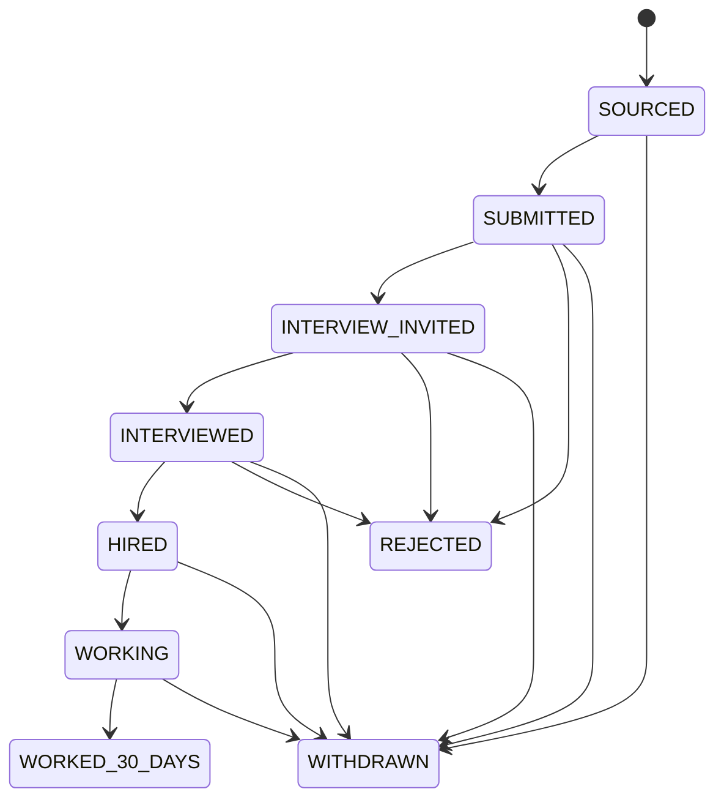

# Candidate and Application API

All routes require authenticated RecruitOps sessions. Read endpoints allow `OWNER`, `ADMIN`, `RECRUITER`, and `VIEWER`; mutation endpoints allow `OWNER`, `ADMIN`, and `RECRUITER`.

## Candidate routes

- `GET /candidates` — paginated list; supports `search`, `page`, and `pageSize`.
- `GET /candidates/duplicate-signals` — returns possible duplicate candidate records matching normalized `email` and/or `phone`. A match is only a review signal and never auto-merges records.
- `GET /candidates/:id` — fetch one candidate.
- `POST /candidates` — create a candidate. At least one contact method is required.
- `PATCH /candidates/:id` — update name/contact fields. Setting email or phone to `null` clears that field and its normalized search key.

Candidate email and phone are classified as sensitive PII. Responses must not be written to unaudited logs.

## Application routes

- `GET /applications` — paginated list; supports `candidateId`, `jobId`, `status`, `page`, and `pageSize`.
- `GET /applications/:id` — fetch one application.
- `POST /applications` — create an application after verifying the candidate, job, and optional source destination exist.
- `PATCH /applications/:id/status` — transition the recruitment lifecycle. Invalid transitions are rejected with `INVALID_APPLICATION_STATUS_TRANSITION`.

The optional `occurredAt` value on status updates must be an ISO-8601 timestamp with offset. When omitted, the API records the current server time. Milestone timestamps are stored for `SUBMITTED`, `INTERVIEWED`, `HIRED`, `WORKING`, and `WORKED_30_DAYS`.

## Lifecycle

## Persistence boundary

The API persists through Prisma/PostgreSQL. Candidate duplicate detection uses normalized email/phone indexes and deliberately returns candidate records for human review rather than making an irreversible merge decision.
