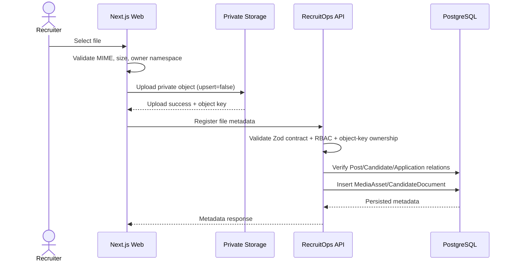

# Private File Metadata API

RecruitOps stores private blobs separately from database metadata. The browser upload adapter writes objects to the private `recruitops-private` bucket first; these endpoints register the corresponding `MediaAsset` or `CandidateDocument` metadata only after the upload succeeds.

## Security boundary

Metadata registration is authenticated and limited to `OWNER`, `ADMIN`, and `RECRUITER`.

The submitted object key must exactly follow the authenticated user's namespace:

```text
<userId>/media/<postId>/<objectId>.<extension>
<userId>/candidates/<candidateId>/<objectId>.<extension>
```

The API rejects keys for another user, another entity, malformed traversal-like keys, disabled/missing domain parents, and duplicate storage keys.

Candidate-document reads are intentionally not exposed to the `VIEWER` role because CV metadata is candidate PII. Content-media metadata may be read by `VIEWER`.

## Routes

### Media

- `POST /files/media-assets` — register metadata for an already-uploaded private content object.
- `GET /posts/:postId/media-assets` — list registered media for a post.

Registration verifies the Post exists. File sizes are accepted only within JavaScript safe-integer range and persisted as PostgreSQL/Prisma `BigInt`.

### Candidate documents

- `POST /files/candidate-documents` — register metadata for an already-uploaded CV/document.
- `GET /candidates/:candidateId/documents` — list private document metadata for a candidate.

Registration verifies the Candidate exists. When `applicationId` is supplied, the API also verifies that Application exists and belongs to the same Candidate.

## Upload-to-persistence sequence



## Current limitation

This API registers metadata and enforces ownership of the object-key namespace, but it does not independently query Supabase Storage to prove the blob exists. The current browser flow must call registration only after a successful private upload. A server-mediated signed-access/download endpoint remains future work for cross-recruiter authorized CV access.
