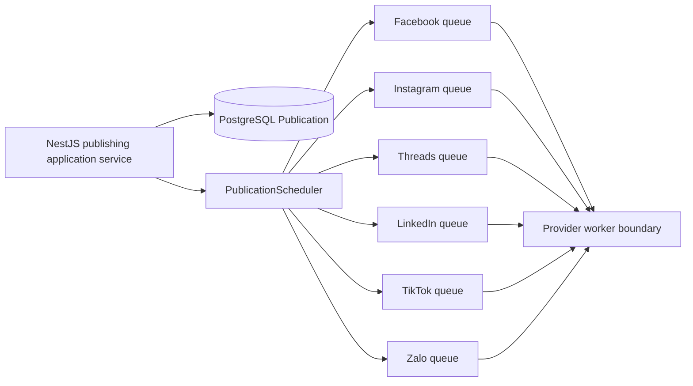

# BullMQ Publication Queue Architecture

## Purpose

RecruitOps uses BullMQ as the delayed/background transport between persisted Publication state and provider-specific publishing workers.

## Queue isolation

Each platform has a separate queue named `recruitops-publications-<platform>`. This permits provider-specific concurrency/rate limits and prevents a slow or throttled provider from consuming the capacity of every social platform.

## Idempotency

Two IDs have different responsibilities:

- PostgreSQL keeps the unique application idempotency key `publication:<uuid>`.
- BullMQ uses `publication-<uuid>` because custom BullMQ job IDs cannot contain `:`.

The database remains authoritative. Queue-level duplicate suppression is only an additional defense while a retained job with the same ID still exists. Workers must therefore remain idempotent and re-check persisted Publication state before performing a provider side effect.

## Scheduling and retry

`PublicationScheduler` converts a future `runAt` into a BullMQ delayed job. Past/current timestamps use zero delay.

Jobs currently receive the shared Publication retry policy: five attempts with exponential backoff starting at one second. Completed and failed jobs are retained with bounded age/count policies to support debugging without unbounded Redis growth.

Provider processors must persist each meaningful Publication state transition/error. BullMQ retry metadata is transport state, not a substitute for PostgreSQL Publication state.

## Worker rate-limit boundary

`createPublicationWorker` creates a real BullMQ Worker with:

- configurable local concurrency;
- a BullMQ limiter;
- payload/platform validation before invoking the provider processor;
- the current attempt number exposed to the processor.

The default limiter (`1` job per `1000 ms`) is an internal conservative safety guardrail, **not a claim about any provider's official quota**. A provider adapter may override it only after its current official API rules are checked and documented.

## Deployment boundary

Local and future worker runtimes use `REDIS_URL`. The existing Render Key Value Free instance is the Redis transport.

No paid Render Background Worker is provisioned under the project's `$0-only` rule. This package implements and tests the queue/worker boundary, but provider workers are not considered production-active until a compliant free execution strategy is wired and verified. Provider adapters remain unchecked in `MASTER_PLAN.md` until then.
