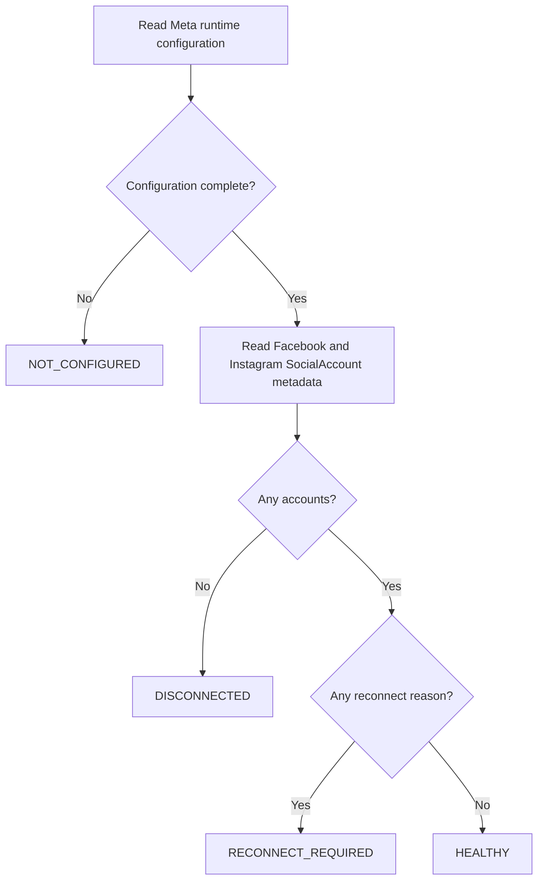

# Integration Health Boundary

## Scope

Integration health is an authenticated operational view over RecruitOps social-account metadata and server configuration. It is not a provider-token introspection endpoint and it never decrypts credentials merely to render a dashboard.

The current implementation covers Meta because Facebook and Instagram are the first supported OAuth connection flow. The contract is separated from the Meta OAuth callback so future providers can join the same health surface without coupling their authorization protocol to the UI.

## Endpoint

`GET /api/integrations/health`

Authorization:

- Supabase-authenticated session required;
- `OWNER` or `ADMIN` role required;
- response uses `Cache-Control: no-store`.

## Meta readiness

The API considers the Meta runtime configured only when both boundaries validate:

1. Meta OAuth configuration: client ID, client secret, explicit Graph API version, provider callback URI and frontend return URI;
2. OAuth credential-encryption configuration: valid active key ID and AES-256-GCM keyring.

Only the boolean readiness result is returned. Secret values and key identifiers are not exposed by this endpoint.

## Account health

The API reads only these durable `SocialAccount` fields:

- account ID;
- platform;
- display name;
- status;
- optional `expiresAt`;
- whether a credential reference exists.

It does not select the `SocialCredential` ciphertext, IV, authentication tag or provider token payload.

Reconnect reasons are derived in this order:

1. `MISSING_CREDENTIAL` when the social account has no durable credential reference;
2. `REVOKED` when durable account status is `REVOKED`;
3. `ERROR` when durable account status is `ERROR`;
4. `EXPIRED` when durable account status is `EXPIRED` or `expiresAt` is at/before the current time.

A connected account with no reconnect reason is considered healthy.

## Aggregate provider state

## Reconnect behavior

The health endpoint is advisory and read-only. When the UI sees an account that requires reconnect, it starts the existing official OAuth authorization path for that account platform. The operator must still explicitly select a discovered account before credential promotion.

Reconnect therefore preserves the same guarantees as first-time connection:

- no provider token in browser state;
- one-time OAuth state validation;
- server-side credential encryption;
- explicit account selection;
- durable promotion updates matching accounts instead of silently creating duplicates.

## Limitations

This boundary reports what RecruitOps currently knows from durable state and runtime configuration. It does not make a background provider request on every health page load, so a provider-side revocation that has not yet been observed by RecruitOps may still appear healthy until a provider operation detects it and persists an updated account status.

Real-provider E2E activation, hosted credential migration execution and production secret/key provisioning remain separate production-readiness requirements.
