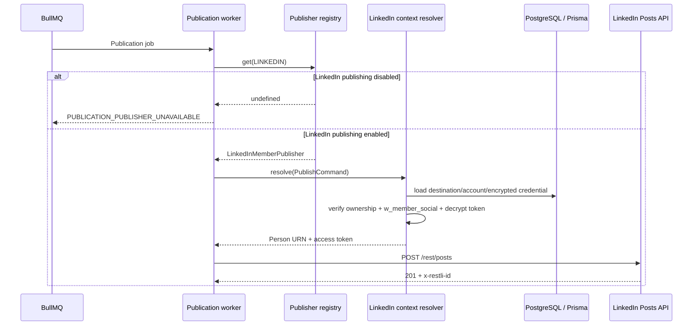

# LinkedIn Member Publishing

## Scope

RecruitOps implements a fail-closed LinkedIn **member** publishing slice behind the vendor-neutral `SocialPublisher` contract.

The implementation intentionally supports only text, hashtags, and an optional link. It does not claim LinkedIn organization posting or media upload support.

## Official capability basis

The adapter uses LinkedIn's current Posts API:

- `POST https://api.linkedin.com/rest/posts`
- `w_member_social` is required for authenticated member publishing.
- Requests include `X-Restli-Protocol-Version: 2.0.0`.
- Requests include `Linkedin-Version` as an explicit `YYYYMM` version.
- A successful create returns the created post URN in the `x-restli-id` response header.

The member connection flow already stores the authenticated OpenID Connect subject as the LinkedIn account/destination external identifier. At worker execution time, the publishing context resolver validates that identifier and derives the Person URN as `urn:li:person:{id}`.

## Runtime boundary

LinkedIn publishing is disabled by default. The worker registers `LinkedInMemberPublisher` only when both conditions are satisfied:

- `PUBLISHING_LINKEDIN_ENABLED=true`
- `LINKEDIN_API_VERSION` is a six-digit `YYYYMM` value

The worker then resolves the exact `Destination -> SocialAccount -> SocialCredential` relation for the Publication, verifies platform/account ownership and `CONNECTED` state, requires `w_member_social` in both persisted account scopes and the encrypted credential payload, and decrypts the access token only in memory immediately before provider execution.

## Validation and security rules

- Media IDs are rejected instead of silently dropped.
- Empty commentary is rejected.
- Commentary is bounded to 3000 characters in this slice.
- The Person URN and API version are format-validated before a request is sent.
- Provider response bodies are not copied into RecruitOps errors.
- Access tokens are sent only in the Authorization header and are never persisted in Publication results or logs.
- Generic `getStatus` remains `UNKNOWN` until a credential-aware reconciliation path is implemented; the adapter does not fabricate provider certainty.

## Production gates

Code-side support does not complete the Master Plan item by itself. The item remains open until the LinkedIn app/product access, hosted credentials, worker activation, and real-provider integration/E2E verification are completed. Organization posting requires a separate permission/role capability review before implementation.
