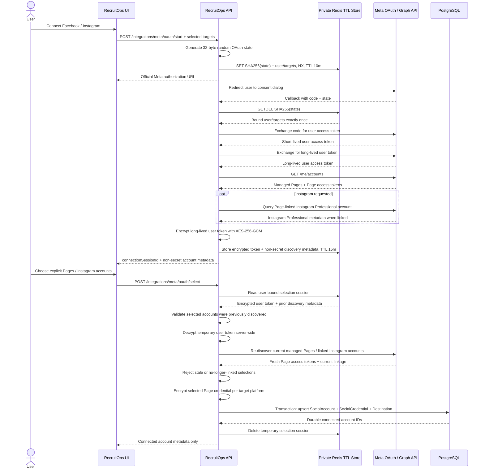

# Meta Official Connection Boundary

## Scope verified for this slice

RecruitOps uses Meta's official OAuth/Graph API path only. The current connection boundary supports discovery and explicit promotion for:

- Facebook Pages managed by the authenticated Facebook user;
- Instagram Professional accounts linked to those Pages through **Instagram API with Facebook Login**.

The integration does not use private endpoints, browser session scraping, undocumented cookies, or consumer Instagram accounts.

## Permissions

Facebook Page target requests only:

- `pages_show_list`
- `pages_read_engagement`
- `pages_manage_posts`

Instagram Professional target through Facebook Login requests only:

- `pages_show_list`
- `pages_read_engagement`
- `instagram_basic`
- `instagram_content_publish`

When both targets are selected the permission set is de-duplicated. Messaging, comments, ads, insights, business-management and other unrelated scopes are intentionally excluded from this connection boundary.

## OAuth and promotion flow

## State and temporary session security

OAuth state is API-generated from 32 cryptographically random bytes. The raw state value is sent only through the authorization redirect; Redis stores only `SHA-256(state)` as the key, bound to the initiating RecruitOps user ID and requested targets.

State records expire after 10 minutes and are consumed with Redis `GETDEL`, making callback validation atomic and one-time. An expired, unknown or replayed state fails before RecruitOps contacts Meta.

After a successful callback, RecruitOps creates a separate 15-minute selection session. The long-lived Meta user token is encrypted with the same AES-256-GCM keyring used by the durable OAuth credential boundary before it is written to Redis. Page access tokens returned during discovery are not persisted in the temporary session; they are rediscovered when the operator confirms which account destinations to connect.

The selection session is bound to the initiating user and contains only:

- requested targets;
- encrypted Meta user-token envelope;
- non-secret Page / Instagram Professional metadata;
- creation and expiration timestamps.

The authenticated selection endpoint accepts only `OWNER` or `ADMIN` callers. A selection must match both the originally requested target and an account discovered in that user's temporary session. Before durable promotion, RecruitOps re-discovers the selected account from Meta so a removed Page or changed Instagram linkage fails closed rather than persisting stale credentials.

The temporary selection session is deleted only after durable promotion succeeds. Provider or database failures leave the short-lived session available for a bounded retry until its TTL expires.

## Durable credential promotion

For Facebook, RecruitOps persists the freshly rediscovered Page access token for the selected Page. For an Instagram Professional account reached through the Facebook Login flow, RecruitOps persists the access token of the Facebook Page linked to that Instagram account for the Instagram social-account credential boundary.

Tokens are encrypted before persistence and are never included in the account-selection response. Promotion writes are transactionally grouped:

- create or update `SocialAccount`;
- create or update its encrypted `SocialCredential`;
- create or update the matching API-enabled `Destination`.

Existing accounts and destinations are updated instead of duplicated, making reconnect/promotion safe to repeat at the database boundary.

## Logging boundary

HTTP and authentication/authorization audit logging records request paths only. Query strings are stripped before logging so OAuth callback `code` and `state` values cannot enter the current Render/stdout log path.

The callback returns `Cache-Control: no-store` and `Referrer-Policy: no-referrer`. Authenticated start/selection responses also use `Cache-Control: no-store`.

## Provider boundary

`@recruitops/integrations` never persists credentials and never logs provider response bodies. The Meta app secret is used only server-side during token exchange. Resource requests use bearer authorization headers so access tokens are not placed in RecruitOps-generated Graph API query strings.

The API version is explicit configuration (`META_GRAPH_API_VERSION`) rather than silently hard-coded into product logic. The redirect URI is explicit configuration (`META_REDIRECT_URI`) and must match the Meta app configuration exactly.

## Current product boundary

RecruitOps no longer auto-connects every managed Page. The backend now requires an authenticated `OWNER` or `ADMIN` to submit an explicit subset from the discovered accounts before durable credentials and destinations are promoted.

The browser-facing account picker that drives this endpoint is still outstanding. Production activation and real-provider E2E verification are also outstanding, so this backend flow alone does not make the Meta integration production-ready.

## Production activation still required

1. approved Meta app configuration and exact redirect URI;
2. App Review / advanced access where Meta requires it for non-role users;
3. runtime `META_CLIENT_ID`, `META_CLIENT_SECRET`, `META_GRAPH_API_VERSION` and `META_REDIRECT_URI` configuration;
4. production OAuth encryption key provisioning;
5. hosted `social_credentials` migration execution;
6. frontend account-selection UX wired to the authenticated promotion endpoint;
7. integration/E2E verification against the configured Meta app.

Until those are complete, the Master Plan Meta connection item remains unchecked.
