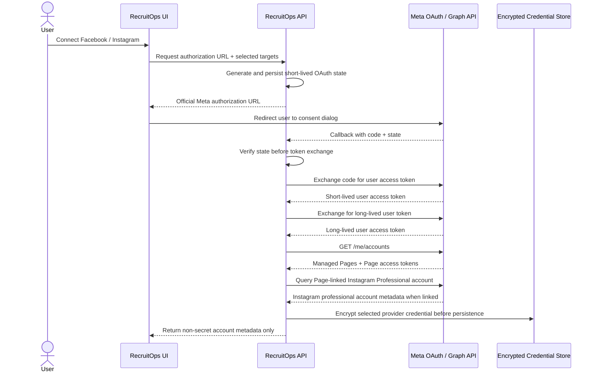

# Meta Official Connection Boundary

## Scope verified for this slice

RecruitOps uses Meta's official OAuth/Graph API path only. This slice supports discovery for:

- Facebook Pages managed by the authenticated Facebook user;
- Instagram Professional accounts linked to those Pages through **Instagram API with Facebook Login**.

The integration does not use private endpoints, browser session scraping, undocumented cookies, or consumer Instagram accounts.

## Permissions

Facebook Page target requests only:

- `pages_show_list`
- `pages_read_engagement`
- `pages_manage_posts`

Instagram Professional target through Facebook Login requests only:

- `pages_show_list`
- `pages_read_engagement`
- `instagram_basic`
- `instagram_content_publish`

When both targets are selected the permission set is de-duplicated. Messaging, comments, ads, insights, business-management and other unrelated scopes are intentionally excluded from this connection boundary.

## OAuth flow

## Security boundary

`@recruitops/integrations` never persists credentials and never logs provider response bodies. The Meta app secret is used only server-side during token exchange. Resource requests use bearer authorization headers so access tokens are not placed in RecruitOps-generated Graph API query strings.

OAuth `state` is mandatory and must be generated/verified by the API layer. The provider boundary rejects short state values but does not own state persistence because state must be bound to the authenticated RecruitOps session/user.

The API version is explicit configuration (`vN.N`) rather than silently hard-coded into product logic. This allows Meta version upgrades to be reviewed and tested deliberately.

## Persistence boundary

This package returns provider tokens only to the trusted server caller. The API layer must pass selected credentials directly to `OAuthCredentialStore`; tokens must never be returned through public/shared DTOs.

Production activation still requires:

1. approved Meta app configuration and redirect URI;
2. App Review / advanced access where Meta requires it for non-role users;
3. runtime Meta app ID/secret configuration;
4. production OAuth encryption key provisioning;
5. hosted `social_credentials` migration execution;
6. callback/UI wiring and authorization tests.

Until those are complete, the Master Plan item remains unchecked.
