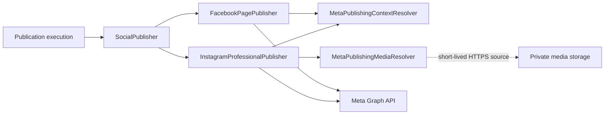

# Meta Publishing Adapter Boundary

## Scope

This slice implements provider adapters behind the vendor-neutral `SocialPublisher` contract for the Meta capabilities that have a verified server-side credential path in RecruitOps:

- Facebook Page text/link publishing;
- Instagram Professional single-image publishing;
- Instagram Professional Reel publishing.

It does not introduce a browser automation path, consumer Instagram support, arbitrary Facebook Group posting, or undocumented endpoints.

## Current official basis

Facebook Page publishing uses the Page access-token boundary already established by the Meta connection flow and the `pages_manage_posts` permission.

Instagram publishing uses **Instagram API with Facebook Login**. The account must be an Instagram Professional account linked to a Facebook Page. The current connection flow requests `instagram_basic` and `instagram_content_publish` together with the Page discovery permissions.

For Reels, the official flow is:

1. create a media container on the Instagram Professional account with `media_type=REELS` and a provider-fetchable `video_url`;
2. poll the container status until `status_code=FINISHED`;
3. publish the container through `/{ig-user-id}/media_publish`.

The official API requires the media URL to be reachable by Meta while the container is created.

## Adapter architecture

The integrations package owns provider request construction, payload validation and provider error normalization. It does not own database queries, OAuth credential decryption or object-storage signing.

## Publishing context

`MetaPublishingContextResolver` must supply, server-side:

- the target platform;
- the selected destination external ID;
- the decrypted provider access token for the current operation.

The provider token is never placed in the shared `PublishCommand`, browser payload, callback URL or provider URL query string. The adapters send it in the bearer authorization header.

A future worker/application resolver will derive this context from the durable `Publication -> Destination -> SocialAccount -> SocialCredential` boundary and decrypt only at the execution point.

## Private media boundary

RecruitOps content media is private by default. The Instagram adapter therefore receives media through `MetaPublishingMediaResolver` rather than reading a storage key directly.

The resolver contract returns:

- original RecruitOps media ID;
- media kind (`IMAGE` or `VIDEO`);
- an HTTPS provider-fetchable URL.

The adapter rejects non-HTTPS URLs and URLs containing embedded username/password credentials. The intended production implementation is a short-lived signed object URL whose lifetime covers the provider ingestion window. The bucket itself must remain private.

## Facebook Page capability

The current Facebook adapter publishes text/hashtags and an optional link to the selected Page feed. Media IDs are rejected explicitly in this slice.

This is intentional: Facebook media upload behavior is not silently approximated from the Instagram URL-ingestion model. A later capability slice can add verified Facebook image/video publishing without changing the `SocialPublisher` contract.

## Instagram image capability

The adapter requires exactly one media ID. For an image it:

1. resolves a short-lived HTTPS media URL;
2. creates a media container with `image_url` and optional caption;
3. publishes the returned container through `media_publish`.

The normalized result stores the final Instagram media ID as `externalPostId` and the creation-container ID as `providerRequestId`.

## Instagram Reel capability

For video the adapter:

1. creates a `REELS` container with `video_url`, caption and `share_to_feed=true`;
2. polls `status_code,status` with bounded attempts and a configurable interval;
3. fails immediately on provider `ERROR` or `EXPIRED` status;
4. fails closed with a timeout if the container never becomes ready;
5. calls `media_publish` only after `FINISHED`.

The polling controls are bounded to prevent an accidental unbounded worker execution.

## Error boundary

Provider response bodies are not copied into RecruitOps errors. When a Graph API error includes a numeric provider code, RecruitOps retains only that code in a normalized internal error identifier, for example:

`META_FACEBOOK_PAGE_PUBLISH_FAILED_PROVIDER_190`

This preserves actionable classification without logging provider payloads that may include sensitive detail.

## Current status-reconciliation boundary

Both adapters implement the required `SocialPublisher.getStatus` method conservatively as `UNKNOWN` for now.

This is deliberate. Generic status reconciliation needs a persisted-publication-to-credential resolver and provider-specific object-status semantics. Until that execution context is implemented and verified, the adapter does not fabricate a `PUBLISHED`/`FAILED` conclusion from an unverified lookup path.

## Remaining activation work

These adapters are library-level provider implementations. They do not make production publishing active by themselves. Remaining execution work includes:

- server-side publishing context resolver with durable credential decryption;
- short-lived private-media URL resolver for provider ingestion;
- worker handler wiring from `PublicationQueueJob` to `SocialPublisher`;
- publication state persistence around provider execution;
- production Meta runtime/credential activation and real-provider E2E verification;
- publish-now / scheduling / status UI.
