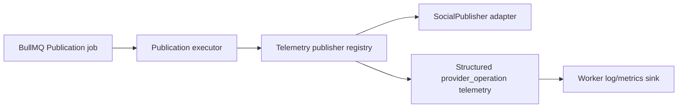

# Provider Runtime Telemetry

## Purpose

RecruitOps records bounded operational telemetry around every vendor-neutral `SocialPublisher` operation at the worker composition boundary. Instrumentation is applied by wrapping the publisher registry, so provider adapters keep their business/API responsibilities and all enabled providers receive the same telemetry contract.

## Events

The worker emits structured `provider_operation` events for:

- `validate`;
- `publish`;
- `get_status`.

Each event contains only operational metadata:

- provider platform;
- operation;
- outcome;
- elapsed `durationMs`;
- publication correlation ID when the command has one;
- integer HTTP status code on provider errors when available.

HTTP `429` errors are classified as `rate_limited`. Other provider exceptions are classified as `error`. Successful publish outcomes distinguish `published` and `processing`; validation distinguishes `valid` and `invalid`.

## Privacy and failure isolation

Telemetry deliberately excludes post text, hashtags, links, media URLs, access/refresh tokens, signed storage URLs, raw provider response bodies, candidate data and other PII.

A telemetry sink failure is swallowed at the instrumentation boundary. Logging/metrics must never change whether a social provider operation succeeds, fails, retries or reaches a terminal Publication state.

## Correlation

Publish and validate telemetry includes the durable publication correlation identifier propagated through API → Publication → BullMQ → worker → `PublishCommand`. This enables cross-runtime incident investigation without using provider credentials or payload content as search keys.

## Architecture

The current implementation emits structured worker events through the existing runtime logger. A future metrics backend may consume the same bounded event contract without modifying provider adapters.
