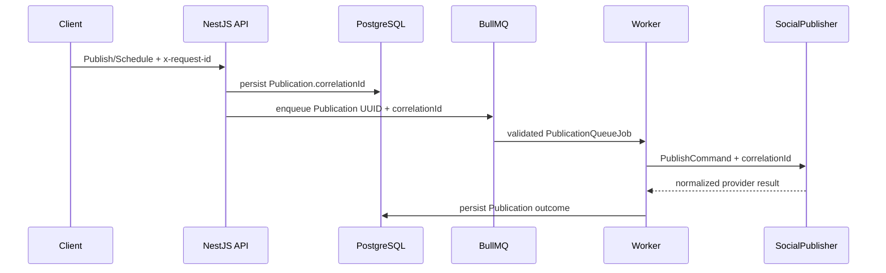

# Publication Correlation

## Purpose

RecruitOps carries one bounded operational correlation identifier from the inbound API request through durable publication state, BullMQ delivery, worker execution, and the vendor-neutral provider command.

The identifier is diagnostic metadata only. It is not an idempotency key, authentication token, provider credential, candidate identifier, or business key.

## Source and validation

The API request baseline accepts `x-request-id` when it is present and at most 128 characters; otherwise it creates a UUID. Publish Now and Schedule pass that request identifier into the publication command path.

The first durable Publication created for a client-generated Publication UUID stores the correlation identifier in `Publication.correlationId`. Repeating the same logical publication intent keeps the already-persisted value rather than replacing it with a later HTTP request ID.

Before BullMQ invokes the worker, correlation metadata is normalized and rejected when empty or longer than 128 characters. No PII should be used as a correlation identifier.

## Propagation path

## Retry semantics

Automatic BullMQ retries retain the same queue job payload and therefore the same correlation identifier.

For manual retry, the API reloads the durable Publication and reuses its persisted `correlationId`. If BullMQ retention has already removed the failed job, the replacement job is created with the same Publication UUID and the same correlation identifier.

This keeps one publication attempt chain searchable across API, queue, worker and provider-side structured telemetry without changing publication identity.

## Security and privacy

- Never place access tokens, refresh tokens, signed media URLs, CV data, email addresses, phone numbers or other PII in correlation identifiers.
- Correlation identifiers are bounded to 128 characters at runtime boundaries.
- Provider adapters may attach the correlation identifier to structured internal telemetry, but must not send it to external providers unless that provider contract explicitly supports a safe request-correlation field.
- The Publication UUID remains the BullMQ job identity and the publication idempotency key remains separate.

## Operational use

When investigating a publication incident, prefer the durable Publication UUID as the primary business identifier and the correlation identifier as the cross-runtime search key. The publication operations runbook should be followed for ambiguous provider outcomes; correlation data does not make blind replay safe.
