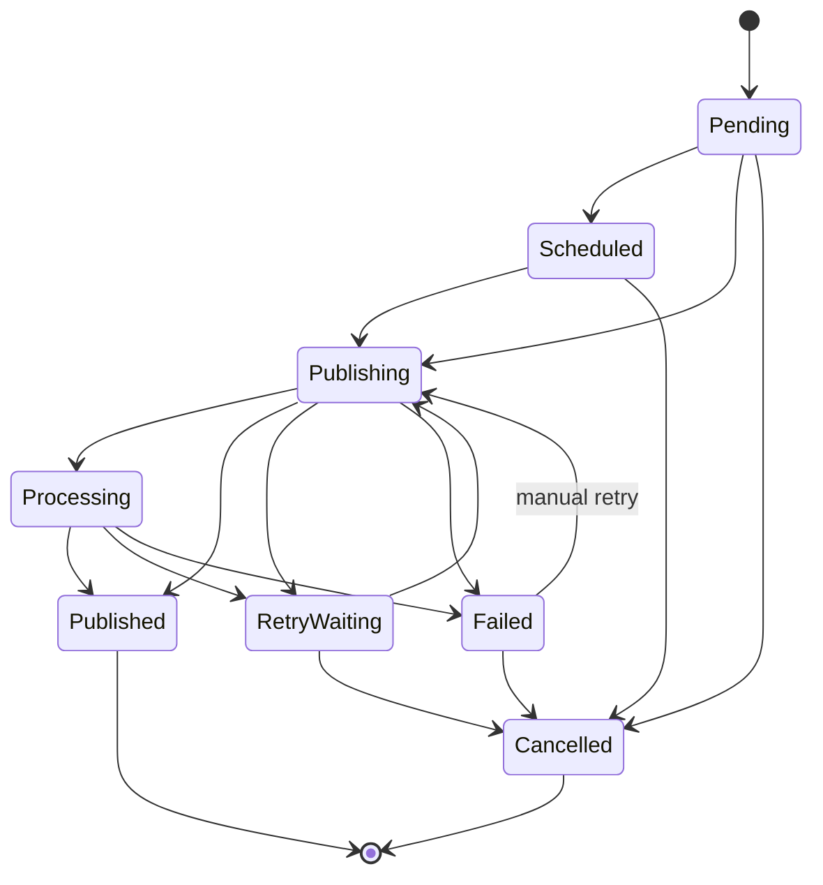

# Publication Domain

A Publication is one logical distribution of one `PostVariant` to one `Destination`.

## Identity and idempotency

Each Publication has an opaque UUID and a persisted unique `idempotencyKey` derived from that logical Publication ID.

The same key is reused for queue retries and provider retry attempts. Creating a new intentional re-post requires a new Publication ID, which produces a new idempotency key. This avoids treating an operator's legitimate later re-post as an accidental duplicate.

## Lifecycle



`PUBLISHED` and `CANCELLED` are terminal. `FAILED` can only leave through an explicit manual retry or cancellation.

## Retry policy

The shared domain contract implements bounded exponential backoff:

```text
baseDelay × 2^(attempt - 1)
```

The delay is capped by `maxDelayMs`. The default policy uses:
- max attempts: 5;
- base delay: 1 second;
- maximum delay: 15 minutes.

Provider adapters will decide whether an individual error is retryable. A non-retryable error becomes terminal immediately. Actual queue jitter and rate-limit-aware scheduling belong to the BullMQ worker implementation and remain separate from this deterministic domain policy.

## Persistence

Publication records retain operational identifiers and failure metadata needed for safe recovery:
- destination/account/variant IDs;
- current lifecycle state;
- unique idempotency key;
- schedule/published/retry timestamps;
- retry count;
- provider request/post identifiers;
- external URL;
- correlation ID;
- last normalized failure code/message.

Deletion of a PostVariant or Destination is restricted while Publication history exists, preserving operational/audit history.
