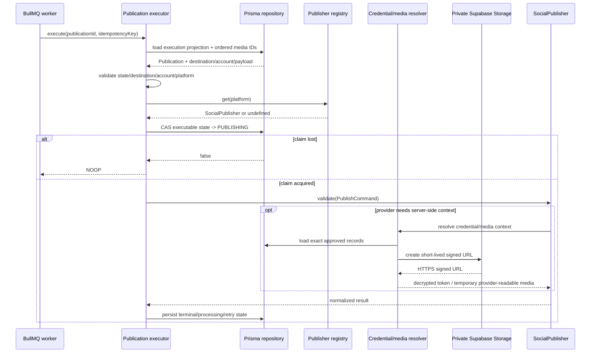

# Publication Execution Boundary

## Purpose

The publication executor is the stateful boundary between a validated BullMQ publication job and a vendor-neutral `SocialPublisher` implementation.

It deliberately does not own provider credentials, provider SDK setup, or media URL generation. Those remain runtime resolver responsibilities.

## Execution rules

For one durable Publication job, the executor:

1. loads the current Publication execution projection;
2. treats `PUBLISHED`, `CANCELLED`, and `PROCESSING` as idempotent no-op states;
3. rejects an idempotency-key mismatch;
4. fails closed if the destination is disabled, manual-only, missing a connected social account, or platform-inconsistent;
5. resolves a publisher through the vendor-neutral registry;
6. atomically claims the Publication by moving its current executable state to `PUBLISHING`;
7. validates the normalized `PublishCommand` through the selected adapter;
8. persists `PUBLISHED` or `PROCESSING` provider results;
9. classifies provider failures into retryable and terminal outcomes.

Only HTTP 429 and provider/server errors with status >= 500 are treated as retryable by the generic executor. Provider-specific adapters remain responsible for translating provider responses into normalized safe errors.

## Prisma execution projection

`PrismaPublicationExecutionRepository` is the concrete persistence adapter used by the worker composition boundary.

Its read projection intentionally contains only execution-safe business data:

- Publication identity, state, retry count and idempotency key;
- PostVariant platform, text, hashtags, link and object-shaped metadata;
- ordered PostVariant media-selection IDs;
- Destination identity, platform, posting mode, enabled state and social-account reference;
- Publication SocialAccount identity, platform and connection status.

It does **not** select OAuth credentials, encrypted credential envelopes, private storage keys, signed media URLs, or provider tokens. Credential decryption stays behind the provider context resolver at the execution point.

State claims and result writes use a single Prisma `updateMany` predicate over Publication ID plus expected state. A worker only owns an attempt when exactly one row matches.

### Media selection boundary

Private MediaAssets remain owned by the canonical Post. Publishing media is explicit: `PostVariantMediaAsset` stores the ordered set selected for one platform variant.

The Content API validates replacement selections before writing them:

- duplicate media IDs are rejected by the shared Zod contract;
- the PostVariant must exist;
- every selected MediaAsset must belong to the same Post as the variant;
- replacement runs transactionally;
- database keys preserve asset uniqueness and ordering positions.

The worker reads only `mediaAssetId` from that relation, ordered by `position`, and maps those IDs to `PublishCommand.payload.mediaIds`. It never falls back to all Post media. An empty selection therefore stays empty.

Private storage keys do not enter the generic executor payload.

### Provider-readable media URL boundary

`PrismaProviderMediaResolver` is the worker-only bridge from explicit `payload.mediaIds` to provider-readable media sources. It performs a narrow Prisma lookup after publication selection, preserves the incoming media order, rejects duplicate/excessive IDs, fails closed when an asset is missing, and refuses `DOCUMENT` assets.

`SupabaseProviderMediaUrlSigner` then creates a short-lived signed URL from the private `recruitops-private` bucket using the server-only modern Supabase secret-key form. The signer accepts only HTTPS Supabase URLs, validates the returned signed URL remains on the configured Supabase origin, and bounds the signed URL lifetime to 60–3600 seconds (900 seconds by default).

The signed URL is an in-memory bearer capability used only for the immediate provider request. RecruitOps does not persist/log the URL, query token, private storage key, or Supabase secret key. Browser contracts continue to exchange opaque MediaAsset UUIDs only.

The resolver implements both the Instagram and Threads media-resolver interfaces so those provider runtimes can share one private-media boundary.

## Queue handler composition

`createPublicationJobHandler` adapts the validated BullMQ `PublicationQueueJob` into the executor identity contract. Queue scheduling metadata is not treated as provider input; the durable Publication row remains the source of truth for execution state.

## Credential and publisher runtime

OAuth credential crypto is shared between API writes and worker reads through the same AES-256-GCM implementation and payload contract. A provider-specific resolver loads the exact `Destination -> SocialAccount -> SocialCredential` relation only after the executor has selected a publisher, verifies account/platform ownership again, and decrypts in memory at the execution point.

Facebook remains always registered in the current production registry.

Instagram now has a complete worker composition path but is **disabled by default**. It is registered only when `PUBLISHING_INSTAGRAM_ENABLED=true` and valid private-media signing configuration is present. Enabling the flag without valid `SUPABASE_URL`, server-only `SUPABASE_SECRET_KEY`, bucket and TTL configuration fails worker bootstrap instead of silently creating a partial publisher.

`PrismaInstagramPublishingContextResolver` verifies all of the following before exposing a decrypted token to the adapter:

- the Publication command targets Instagram;
- the Destination and selected SocialAccount match each other and the command;
- both records are Instagram records and the account is still `CONNECTED`;
- the persisted account includes `instagram_basic` and `instagram_content_publish`;
- the encrypted credential is also an Instagram credential and uses the supported encryption algorithm;
- the decrypted credential payload still records the required Instagram scopes;
- the destination external ID is a valid numeric Instagram Professional account ID.

The token promoted by the existing Meta connection flow is the linked Page access token associated with the Instagram Professional account. This matches the repository's current Facebook Login integration model and the official Meta publishing flow.

Threads remains unregistered in the production worker until its dedicated connection/runtime prerequisites are completed. Requests for an unregistered platform fail closed as `PUBLICATION_PUBLISHER_UNAVAILABLE`.

## Retry behavior

The existing publication retry policy remains authoritative:

- at most five attempts;
- exponential delay beginning at one second;
- retry metadata persisted as `RETRY_WAITING`, `retryCount`, and `nextRetryAt`;
- retryable failures are rethrown as `PublicationRetryableError` so BullMQ can execute its configured retry/backoff behavior;
- terminal failures are persisted as `FAILED` and are not rethrown for automatic retry.

The executor stores normalized error codes/messages only. Raw provider response bodies, tokens, credentials and signed media URLs are never persisted through this boundary.

## Ambiguous provider outcome

A process can crash after a provider accepted a publish request but before RecruitOps persisted the provider result. Re-running that request blindly can create duplicate social posts because not every provider operation offers a RecruitOps-controlled idempotency primitive.

Therefore, redelivery of a Publication that is already persisted as `PUBLISHING` fails closed with `PUBLICATION_AMBIGUOUS_OUTCOME`. It is not automatically published again.

## Concurrency

The repository boundary exposes compare-and-set state updates. Only the worker that successfully transitions the current Publication state to `PUBLISHING` owns that execution attempt. Concurrent or stale workers receive a no-op outcome rather than invoking the provider.

## Worker lifecycle

`apps/worker/src/main.ts` validates server-only database, Redis, Meta Graph version and OAuth keyring configuration before consuming the queue. Instagram activation is additionally gated by the explicit runtime flag and server-only media-signing configuration. Startup logs contain only normalized configuration metadata and enabled publisher names, never connection strings, provider tokens, encryption keys, signed URLs or Supabase secret keys.

BullMQ closes before Prisma disconnects during graceful shutdown so no new job can continue after the persistence layer is torn down.

## Sequence

## Remaining runtime work

- inject the Instagram activation flag and `SUPABASE_SECRET_KEY` only into a trusted worker deployment after real Meta app/account configuration is verified;
- verify Instagram queue/database/provider behavior with real integration/E2E coverage before claiming production readiness;
- build the dedicated Threads connection/runtime path before registering Threads;
- provision a deployed always-on worker when the infrastructure tier supports it;
- add recovery/reconciliation handling for ambiguous external outcomes and provider-processing states.
