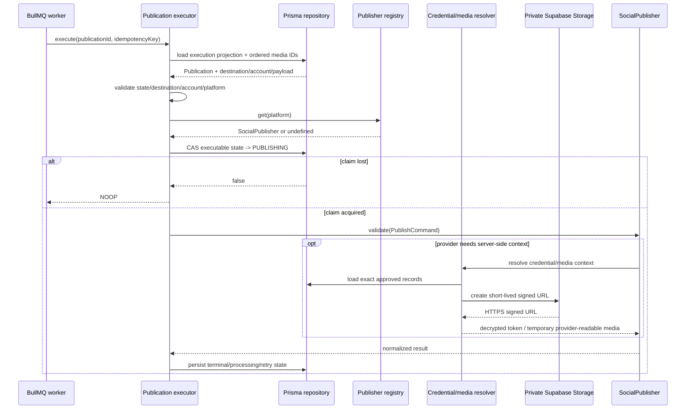
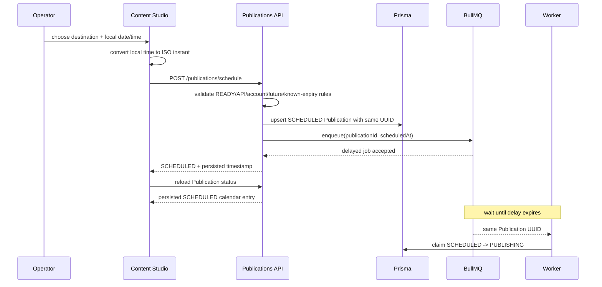
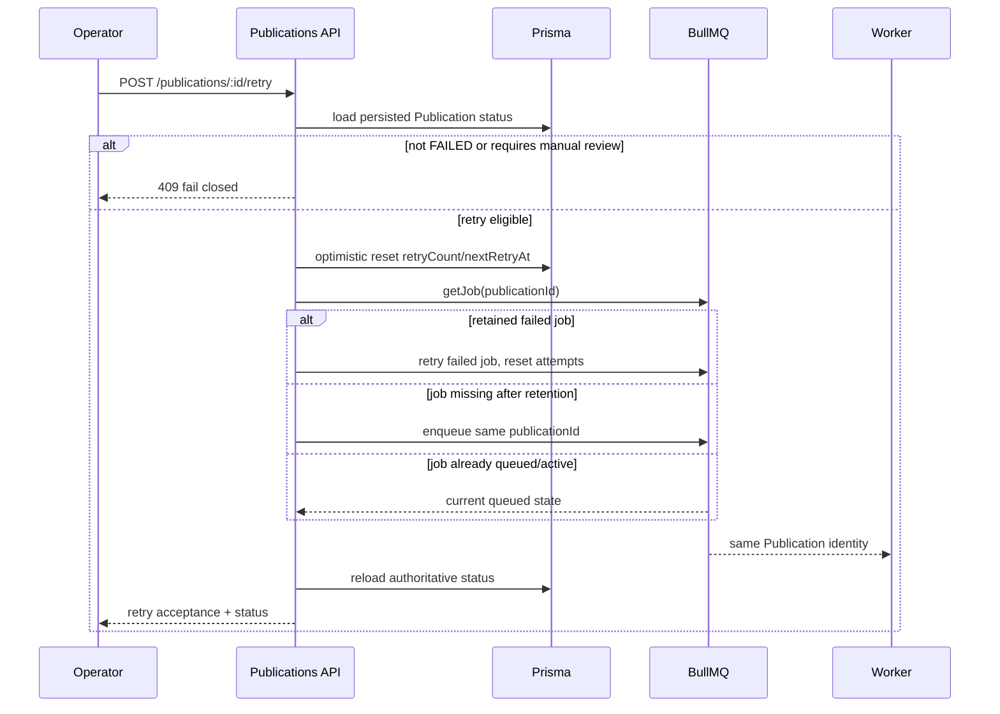

# Publication Execution Boundary

## Purpose

The publication executor is the stateful boundary between a validated BullMQ publication job and a vendor-neutral `SocialPublisher` implementation.

It deliberately does not own provider credentials, provider SDK setup, media URL generation, operator-facing retry decisions, or schedule authoring. Provider context stays behind runtime resolvers, while immediate dispatch, scheduled dispatch, status and retry commands remain API control-plane concerns over the durable `Publication` record.

## Execution rules

For one durable Publication job, the executor:

1. loads the current Publication execution projection;
2. treats `PUBLISHED`, `CANCELLED`, and `PROCESSING` as idempotent no-op states;
3. rejects an idempotency-key mismatch;
4. fails closed if the destination is disabled, manual-only, missing a connected social account, or platform-inconsistent;
5. resolves a publisher through the vendor-neutral registry;
6. atomically claims the Publication by moving its current executable state to `PUBLISHING`;
7. validates the normalized `PublishCommand` through the selected adapter;
8. persists `PUBLISHED` or `PROCESSING` provider results;
9. classifies provider failures into retryable and terminal outcomes.

Only HTTP 429 and provider/server errors with status >= 500 are treated as retryable by the generic executor. Provider-specific adapters remain responsible for translating provider responses into normalized safe errors.

## Prisma execution projection

`PrismaPublicationExecutionRepository` is the concrete persistence adapter used by the worker composition boundary.

Its read projection intentionally contains only execution-safe business data:

- Publication identity, state, retry count and idempotency key;
- PostVariant platform, text, hashtags, link and object-shaped metadata;
- ordered PostVariant media-selection IDs;
- Destination identity, platform, posting mode, enabled state and social-account reference;
- Publication SocialAccount identity, platform and connection status.

It does **not** select OAuth credentials, encrypted credential envelopes, private storage keys, signed media URLs, or provider tokens. Credential decryption stays behind the provider context resolver at the execution point.

State claims and result writes use a single Prisma `updateMany` predicate over Publication ID plus expected state. A worker only owns an attempt when exactly one row matches.

### Media selection boundary

Private MediaAssets remain owned by the canonical Post. Publishing media is explicit: `PostVariantMediaAsset` stores the ordered set selected for one platform variant.

The Content API validates replacement selections before writing them:

- duplicate media IDs are rejected by the shared Zod contract;
- the PostVariant must exist;
- every selected MediaAsset must belong to the same Post as the variant;
- replacement runs transactionally;
- database keys preserve asset uniqueness and ordering positions.

The worker reads only `mediaAssetId` from that relation, ordered by `position`, and maps those IDs to `PublishCommand.payload.mediaIds`. It never falls back to all Post media. An empty selection therefore stays empty.

Private storage keys do not enter the generic executor payload.

### Provider-readable media URL boundary

`PrismaProviderMediaResolver` is the worker-only bridge from explicit `payload.mediaIds` to provider-readable media sources. It performs a narrow Prisma lookup after publication selection, preserves the incoming media order, rejects duplicate/excessive IDs, fails closed when an asset is missing, and refuses `DOCUMENT` assets.

`SupabaseProviderMediaUrlSigner` creates a short-lived signed URL from the private `recruitops-private` bucket using the server-only Supabase secret-key form. The signer accepts only HTTPS Supabase URLs, validates that returned URLs remain on the configured Supabase origin, and bounds lifetime to 60–3600 seconds with a 900-second default.

The signed URL is an in-memory bearer capability used only for the immediate provider request. RecruitOps does not persist or log the URL, query token, private storage key, or Supabase secret key. Browser contracts continue to exchange opaque MediaAsset UUIDs only.

The resolver implements both the Instagram and Threads media-resolver interfaces so those provider runtimes share one private-media boundary.

## Queue handler composition

`createPublicationJobHandler` adapts the validated BullMQ `PublicationQueueJob` into the executor identity contract. Queue scheduling metadata is not treated as provider input; the durable Publication row remains the source of truth for execution state.

The BullMQ job ID is the Publication UUID. Immediate dispatch, delayed scheduling, automatic retries and manual retries therefore preserve the same business identity instead of creating a second Publication record.

For a scheduled Publication, BullMQ delay is calculated from the persisted `scheduledAt` instant. The worker does not call a social provider at schedule-authoring time; it receives the job only after the delay expires and then executes the normal Publication claim/provider flow.

## Credential and publisher runtime

OAuth credential crypto is shared between API writes and worker reads through the same AES-256-GCM implementation and payload contract. A provider-specific resolver loads the exact `Destination -> SocialAccount -> SocialCredential` relation only after the executor has selected a publisher, verifies account/platform ownership again, and decrypts in memory at the execution point.

Facebook remains registered by default in the current worker registry.

Instagram has a complete worker composition path but is **disabled by default**. It is registered only when `PUBLISHING_INSTAGRAM_ENABLED=true` and valid private-media signing configuration is present. Enabling the flag without valid server-only signing configuration fails worker bootstrap instead of creating a partial publisher.

Threads also has a complete code-side worker composition path and is **disabled by default**. It is registered only when `PUBLISHING_THREADS_ENABLED=true` and the same trusted private-media signing boundary is available. Dedicated Threads OAuth/account promotion, encrypted long-lived credential storage, reconnect handling, manual long-lived-token refresh, and integration-health reporting are implemented on the API side. Hosted activation, real Threads app/access configuration, and real-provider publishing/refresh E2E remain separate production gates.

Requests for an unregistered provider fail closed as `PUBLICATION_PUBLISHER_UNAVAILABLE`.

## Immediate and scheduled publication control path

Publish Now and Schedule share the same server-side eligibility boundary: the Post must be `READY`; the selected Destination must be enabled, API-mode and platform-compatible; and the linked SocialAccount must still be connected.

Publish Now persists a `PENDING` Publication with a dispatch time at the current server instant and immediately enqueues it.

Schedule persists a `SCHEDULED` Publication with the requested future absolute instant and enqueues the same Publication UUID as a delayed BullMQ job. The API rejects a scheduled time that is not later than the current server time. If the SocialAccount already has a known `expiresAt`, the API also rejects a requested dispatch at or after that expiry rather than knowingly accepting a job whose credential lifecycle is already invalid at execution time.

The product requirements currently define neither a business timezone nor a maximum scheduling horizon. The browser therefore converts the operator's local date/time to an absolute ISO instant, while PostgreSQL `timestamptz` / the durable `scheduledAt` value remains authoritative after persistence.

Both immediate and scheduled commands preserve the same client-generated Publication UUID across an uncertain queue-enqueue response. Repeating the unchanged intent reconciles the same durable Publication rather than creating another one. Changing destination or schedule time creates a new intent/UUID on the client.

Queue acceptance is not provider success. A persisted `SCHEDULED` record means the delayed dispatch was accepted into RecruitOps' publication workflow; provider execution still occurs later through the normal worker boundary and can fail because of runtime/provider conditions that did not exist when the schedule was created.

## Automatic retry behavior

The existing publication retry policy remains authoritative for retryable worker failures:

- at most five attempts;
- exponential delay beginning at one second;
- retry metadata persisted as `RETRY_WAITING`, `retryCount`, and `nextRetryAt`;
- retryable failures are rethrown as `PublicationRetryableError` so BullMQ can execute its configured retry/backoff behavior;
- terminal failures are persisted as `FAILED` and are not rethrown for automatic retry.

The executor stores normalized error codes/messages only. Raw provider response bodies, tokens, credentials and signed media URLs are never persisted through this boundary.

## Publication status and manual retry control path

The authenticated Publications API exposes bounded, recent operational status for a PostVariant from persisted `Publication` rows. The UI does not infer provider success from a button click or from queue acceptance.

Status output is intentionally limited to the latest 50 attempts per variant and includes only operational fields such as state, destination, timestamps, retry count, retry timing, and normalized error metadata. Provider secrets and raw provider response bodies are not exposed.

The schedule calendar also derives its upcoming entries from these persisted `SCHEDULED` rows rather than optimistic browser state. If a scheduled instant passes while the row is still `SCHEDULED`, the UI treats that as an overdue operational signal for worker/queue investigation, not as proof of provider failure.

Manual retry follows stricter rules than automatic retry:

- only a persisted `FAILED` Publication can be retried manually;
- `RETRY_WAITING` remains owned by automatic BullMQ/worker backoff and exposes no manual retry action;
- `PUBLICATION_AMBIGUOUS_OUTCOME` and `PUBLICATION_IDEMPOTENCY_KEY_MISMATCH` require manual review and cannot be replayed through the retry endpoint;
- the API performs an optimistic `updatedAt` check before resetting the retry budget, preventing a stale operator action from racing a newer state change;
- the previous error metadata remains persisted until the worker actually claims the retry and clears it through the normal execution transition;
- when the retained BullMQ job is still `failed`, the API uses BullMQ's failed-job retry operation with attempts reset;
- when retention has already removed the failed job, the API re-enqueues the **same Publication UUID** rather than creating a new Publication;
- if the job is already waiting, delayed, prioritized, active, or waiting on children because another retry won the race, the API reports `ALREADY_QUEUED` and does not create a duplicate job.

A queue-side retry failure causes the UI to refresh authoritative persisted state before offering another action. Schedule requests likewise refresh persisted status after the API request settles so an uncertain enqueue cannot leave the browser showing only stale calendar state.

## Ambiguous provider outcome

A process can crash after a provider accepted a publish request but before RecruitOps persisted the provider result. Re-running that request blindly can create duplicate social posts because not every provider operation offers a RecruitOps-controlled idempotency primitive.

Therefore, redelivery of a Publication that is already persisted as `PUBLISHING` fails closed with `PUBLICATION_AMBIGUOUS_OUTCOME`. It is not automatically published again and the manual retry API also blocks replay. An operator must verify the provider before taking another action.

## Concurrency

The repository boundary exposes compare-and-set state updates. Only the worker that successfully transitions the current Publication state to `PUBLISHING` owns that execution attempt. Concurrent or stale workers receive a no-op outcome rather than invoking the provider.

The manual retry control path similarly uses optimistic concurrency on the Publication row, and BullMQ job-state inspection prevents concurrent operators from manufacturing duplicate retries for the same Publication ID.

## Worker lifecycle

`apps/worker/src/main.ts` validates server-only database, Redis, provider configuration and OAuth keyring configuration before consuming the queue. Instagram and Threads activation are additionally gated by explicit runtime flags and server-only media-signing configuration. Startup logs contain only normalized configuration metadata and enabled publisher names, never connection strings, provider tokens, encryption keys, signed URLs or Supabase secret keys.

BullMQ closes before Prisma disconnects during graceful shutdown so no new job can continue after the persistence layer is torn down.

## Execution sequence

## Scheduling sequence

## Manual retry sequence

## Remaining runtime work

- inject Instagram/Threads activation flags and `SUPABASE_SECRET_KEY` only into a trusted worker deployment after real provider app/account configuration is verified;
- verify Facebook/Instagram/Threads queue/database/provider behavior with real integration/E2E coverage before claiming production readiness;
- provision a deployed always-on worker when the infrastructure tier supports it;
- add reconciliation handling for ambiguous external outcomes and provider-processing states;
- complete broader publication runbooks and production operations guidance.
