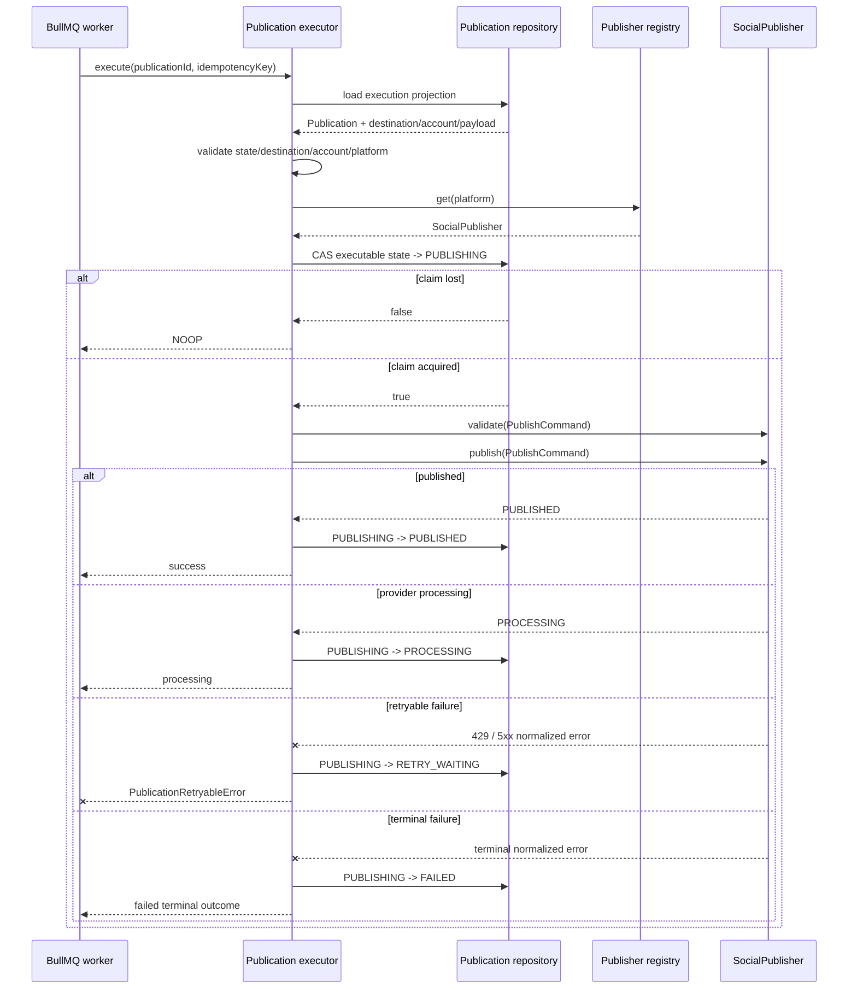

# Publication Execution Boundary

## Purpose

The publication executor is the stateful boundary between a validated BullMQ publication job and a vendor-neutral `SocialPublisher` implementation.

It deliberately does not own provider credentials, provider SDK setup, or media URL generation. Those remain runtime resolver responsibilities.

## Execution rules

For one durable Publication job, the executor:

1. loads the current Publication execution projection;
2. treats `PUBLISHED`, `CANCELLED`, and `PROCESSING` as idempotent no-op states;
3. rejects an idempotency-key mismatch;
4. fails closed if the destination is disabled, manual-only, missing a connected social account, or platform-inconsistent;
5. resolves a publisher through the vendor-neutral registry;
6. atomically claims the Publication by moving its current executable state to `PUBLISHING`;
7. validates the normalized `PublishCommand` through the selected adapter;
8. persists `PUBLISHED` or `PROCESSING` provider results;
9. classifies provider failures into retryable and terminal outcomes.

Only HTTP 429 and provider/server errors with status >= 500 are treated as retryable by the generic executor. Provider-specific adapters remain responsible for translating provider responses into normalized safe errors.

## Retry behavior

The existing publication retry policy remains authoritative:

- at most five attempts;
- exponential delay beginning at one second;
- retry metadata persisted as `RETRY_WAITING`, `retryCount`, and `nextRetryAt`;
- retryable failures are rethrown as `PublicationRetryableError` so BullMQ can execute its configured retry/backoff behavior;
- terminal failures are persisted as `FAILED` and are not rethrown for automatic retry.

The executor stores normalized error codes/messages only. Raw provider response bodies, tokens, and credentials are never persisted through this boundary.

## Ambiguous provider outcome

A process can crash after a provider accepted a publish request but before RecruitOps persisted the provider result. Re-running that request blindly can create duplicate social posts because not every provider operation offers a RecruitOps-controlled idempotency primitive.

Therefore, redelivery of a Publication that is already persisted as `PUBLISHING` fails closed with `PUBLICATION_AMBIGUOUS_OUTCOME`. It is not automatically published again. A later recovery/reconciliation workflow may inspect provider state or require human review before retrying.

This is intentionally safer than assuming exactly-once external side effects.

## Concurrency

The repository boundary exposes compare-and-set state updates. Only the worker that successfully transitions the current Publication state to `PUBLISHING` owns that execution attempt. Concurrent or stale workers receive a no-op outcome rather than invoking the provider.

## Sequence

## Runtime wiring still required

This slice implements and tests execution semantics only. It does not yet claim production worker activation. Runtime completion still requires:

- a Prisma-backed execution repository;
- credential resolvers that decrypt `SocialCredential` only at the execution point;
- publisher registry wiring for production-enabled providers;
- approved private-media URL resolution for media providers;
- worker startup/shutdown wiring;
- integration/E2E verification against the real queue/database/provider boundary.
