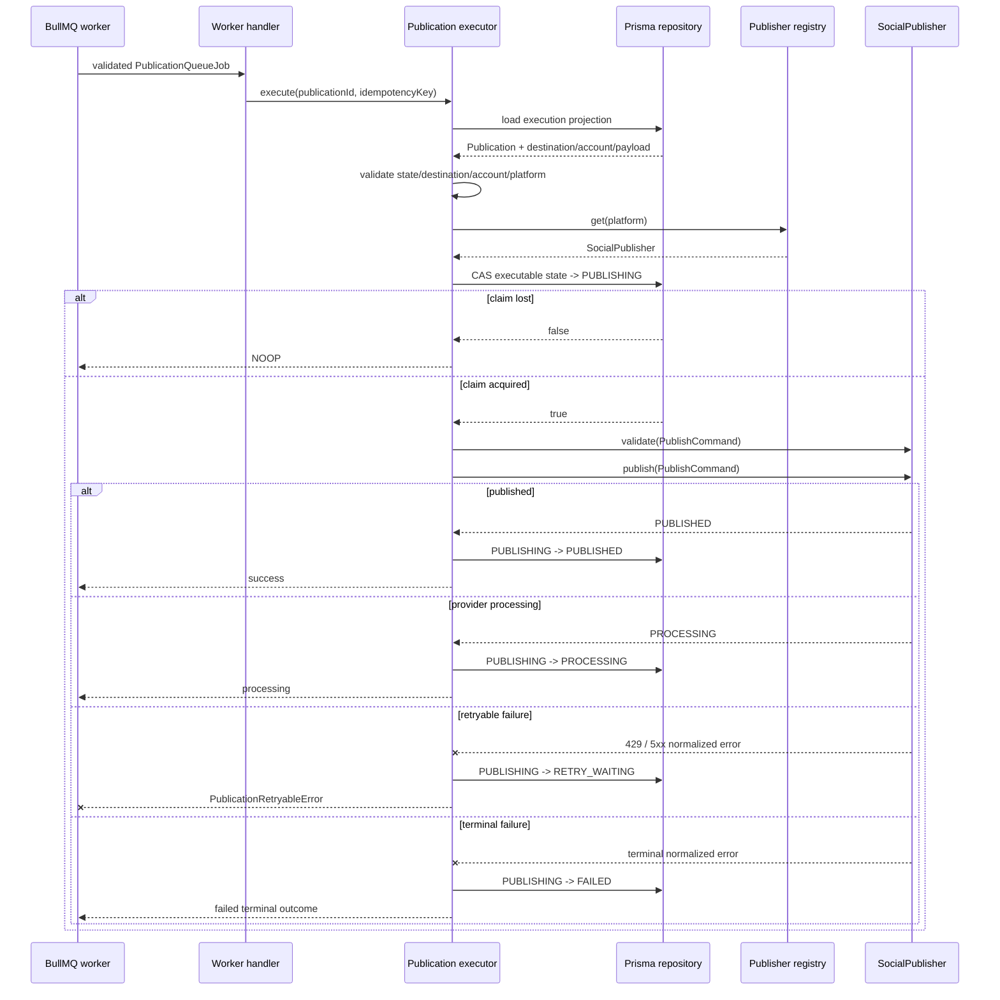

# Publication Execution Boundary

## Purpose

The publication executor is the stateful boundary between a validated BullMQ publication job and a vendor-neutral `SocialPublisher` implementation.

It deliberately does not own provider credentials, provider SDK setup, or media URL generation. Those remain runtime resolver responsibilities.

## Execution rules

For one durable Publication job, the executor:

1. loads the current Publication execution projection;
2. treats `PUBLISHED`, `CANCELLED`, and `PROCESSING` as idempotent no-op states;
3. rejects an idempotency-key mismatch;
4. fails closed if the destination is disabled, manual-only, missing a connected social account, or platform-inconsistent;
5. resolves a publisher through the vendor-neutral registry;
6. atomically claims the Publication by moving its current executable state to `PUBLISHING`;
7. validates the normalized `PublishCommand` through the selected adapter;
8. persists `PUBLISHED` or `PROCESSING` provider results;
9. classifies provider failures into retryable and terminal outcomes.

Only HTTP 429 and provider/server errors with status >= 500 are treated as retryable by the generic executor. Provider-specific adapters remain responsible for translating provider responses into normalized safe errors.

## Prisma execution projection

`PrismaPublicationExecutionRepository` is the concrete persistence adapter used by the worker composition boundary.

Its read projection intentionally contains only execution-safe business data:

- Publication identity, state, retry count and idempotency key;
- PostVariant platform, text, hashtags, link and object-shaped metadata;
- Destination identity, platform, posting mode, enabled state and social-account reference;
- Publication SocialAccount identity, platform and connection status.

It does **not** select OAuth credentials, encrypted credential envelopes, private storage keys, or provider tokens. Credential decryption stays behind the provider context resolver at the execution point.

State claims and result writes use a single Prisma `updateMany` predicate over Publication ID plus expected state. A worker only owns an attempt when exactly one row matches. This provides the compare-and-set behavior required by the executor without relying on process-local locking.

### Media selection boundary

The current persistent model stores `MediaAsset` at the Post level. It does not yet express which assets are selected for a specific `PostVariant` / destination publication. The execution repository therefore does not infer `payload.mediaIds` by attaching every Post asset to every platform variant.

Media IDs must be supplied only after the product model exposes an explicit, validated media-selection rule. This prevents a persistence convenience from silently becoming a cross-platform publishing business rule.

## Queue handler composition

`createPublicationJobHandler` adapts the validated BullMQ `PublicationQueueJob` into the executor identity contract. Queue scheduling metadata is not treated as provider input; the durable Publication row remains the source of truth for execution state.

The handler is intentionally composition-only. It does not construct provider adapters or decrypt credentials.

## Worker OAuth credential resolution

`WorkerOAuthCredentialResolver` is the worker-side credential boundary. It loads the related `SocialAccount -> SocialCredential` envelope only after the durable publication/account relationship has been validated by the execution path.

It fails closed on missing accounts or credentials, platform mismatches, disconnected accounts and expired account/credential metadata. The canonical AES-256-GCM cipher/keyring is shared with the API through `@recruitops/integrations`, so both runtimes use the same authenticated credential-envelope format and rotation rules.

The resolver returns only the provider access token required by a publishing context resolver. Refresh tokens and encrypted envelope fields do not enter queue payloads, browser contracts or the publication executor model.

## Retry behavior

The existing publication retry policy remains authoritative:

- at most five attempts;
- exponential delay beginning at one second;
- retry metadata persisted as `RETRY_WAITING`, `retryCount`, and `nextRetryAt`;
- retryable failures are rethrown as `PublicationRetryableError` so BullMQ can execute its configured retry/backoff behavior;
- terminal failures are persisted as `FAILED` and are not rethrown for automatic retry.

The executor stores normalized error codes/messages only. Raw provider response bodies, tokens, and credentials are never persisted through this boundary.

## Ambiguous provider outcome

A process can crash after a provider accepted a publish request but before RecruitOps persisted the provider result. Re-running that request blindly can create duplicate social posts because not every provider operation offers a RecruitOps-controlled idempotency primitive.

Therefore, redelivery of a Publication that is already persisted as `PUBLISHING` fails closed with `PUBLICATION_AMBIGUOUS_OUTCOME`. It is not automatically published again. A later recovery/reconciliation workflow may inspect provider state or require human review before retrying.

This is intentionally safer than assuming exactly-once external side effects.

## Concurrency

The repository boundary exposes compare-and-set state updates. Only the worker that successfully transitions the current Publication state to `PUBLISHING` owns that execution attempt. Concurrent or stale workers receive a no-op outcome rather than invoking the provider.

## Sequence

## Runtime wiring still required

Execution semantics, Prisma persistence, queue-handler composition and shared worker OAuth credential decryption are implemented and unit-tested. Production worker activation remains intentionally gated until all remaining runtime boundaries are available:

- publisher registry wiring for production-enabled providers;
- explicit media-selection semantics plus approved private-media URL resolution for media providers;
- worker startup/shutdown wiring and graceful Redis/Prisma cleanup;
- integration/E2E verification against the real queue/database/provider boundary.

Until those dependencies are present, `apps/worker/src/main.ts` must not start the publication processor. This avoids consuming real jobs into an intentionally incomplete runtime.
