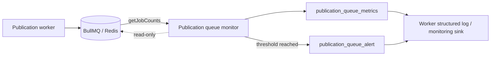

# Publication Queue Monitoring

## Purpose

RecruitOps samples BullMQ publication queue state through BullMQ's public queue getter APIs and emits structured operational metrics plus threshold-based alert events. Monitoring is read-only: it never retries, purges, pauses, promotes or mutates jobs.

## Metrics

Every sampling interval the worker records:

- waiting jobs;
- active jobs;
- delayed jobs;
- failed jobs;
- outstanding jobs (`waiting + active + delayed`).

The monitor uses `Queue.getJobCounts('wait', 'active', 'delayed', 'failed')`; it does not inspect Redis keys directly.

## Alert signals

The worker emits `publication_queue_alert` when either configurable condition is met:

- waiting jobs are greater than or equal to `PUBLICATION_QUEUE_WAITING_ALERT_THRESHOLD`;
- failed jobs are greater than or equal to `PUBLICATION_QUEUE_FAILED_ALERT_THRESHOLD`.

Default operational values are:

- sample interval: 60 seconds;
- waiting backlog alert: 100 jobs;
- failed-job alert: 1 job.

These values are runtime controls rather than business rules and may be tuned per deployment without changing queue semantics.

## Availability boundary

Queue observation is intentionally not on the publication worker startup critical path. The monitor opens its separate read-only BullMQ queue connection lazily at the first scheduled sample. If sampling cannot reach Redis, the worker emits `publication_queue_monitor_error`; provider execution remains available through the worker's own queue connection.

The monitor timer is unreferenced so it does not keep the Node.js process alive by itself. Graceful shutdown stops sampling and closes the observer queue connection before closing the publication worker and Prisma client.

## Operational response

A queue alert is a signal for investigation, not permission for automated destructive recovery. Operators should use the publication operations runbook to determine whether the condition is caused by worker availability, provider failures, delayed schedules, retry backoff or another incident. Ambiguous provider outcomes must never be blindly replayed.

