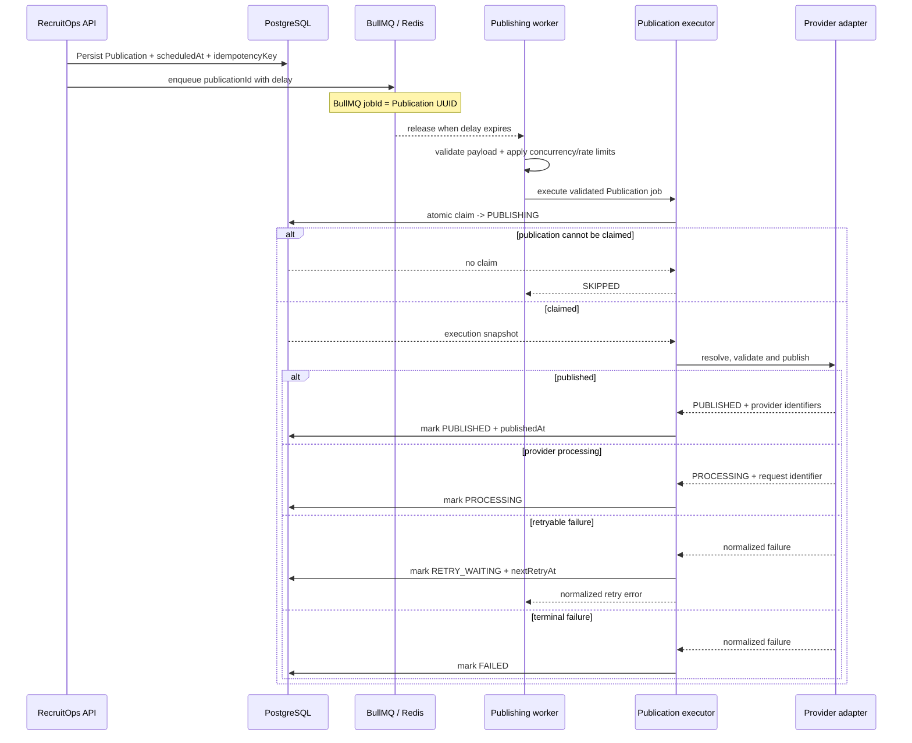

# Publication Scheduling Architecture

RecruitOps uses BullMQ for durable delayed dispatch backed by Redis.

## Boundary

The scheduler is responsible only for queue timing and duplicate-safe enqueue. It does not claim that a social post has been published.

## Reliability

BullMQ delayed jobs are used rather than process-local timers. The queue job ID is the Publication UUID, so duplicate enqueue attempts target the same durable job identity. Retry settings use five total attempts with exponential backoff starting at one second; business retry/terminal state remains persisted in the Publication model.

Delayed jobs are not guaranteed to execute at the exact millisecond when a worker is busy, so product UI should treat `scheduledAt` as the requested dispatch time rather than a hard real-time guarantee.

## Worker boundary

`@recruitops/queue` exposes a publishing-worker boundary that requires an explicit handler. Queue payloads are validated before the handler is called, including Publication UUID, idempotency-key consistency and a parseable scheduled timestamp.

Default worker limits are intentionally conservative:

- concurrency: 4 jobs;
- rate limit: 10 jobs per 1,000 ms window.

Both values are configurable with positive-integer validation. Platform adapters may later use stricter limits when provider-specific quotas are verified from current official documentation.

The generic worker boundary does not contain a fallback provider implementation. This prevents a queue job from being consumed and treated as successful when no supported social-platform adapter exists.

## Execution orchestration

`createPublicationExecutionHandler` is the application-level bridge between a validated BullMQ job and a `SocialPublisher`. It depends on interfaces rather than Prisma, credential encryption, object storage or provider SDK state.

The execution store owns the atomic claim boundary. A job that cannot be claimed is returned as `SKIPPED`, so a duplicate/replayed queue delivery does not call the provider again. A successful claim returns the normalized execution snapshot used to build the shared `PublishCommand`.

Before provider execution, the handler verifies the claimed publication and idempotency key still match the queue job. An integrity mismatch fails closed before a provider is resolved.

The publisher resolver selects the platform adapter. Provider resolution, validation and publishing exceptions are passed through a normalized error classifier so sensitive provider details do not cross the queue/log boundary. Validation results returned normally by a provider are terminal and persist only stable validation issue codes rather than provider-facing text.

## State persistence

The orchestration persists provider outcomes through the execution-store interface:

- `PUBLISHED`: stores normalized provider identifiers and `publishedAt`;
- `PROCESSING`: stores the provider request/container identifier for later reconciliation;
- retryable failure: increments `retryCount`, computes bounded exponential backoff, persists `RETRY_WAITING` + `nextRetryAt`, then throws a normalized `PublicationRetryScheduledError` so BullMQ can retry;
- non-retryable or exhausted failure: increments `retryCount` and persists terminal `FAILED`.

Persistence mutations are intentionally outside provider-error catches. A database consistency failure must surface as an infrastructure failure rather than being mislabeled as a provider error.

## Current completion boundary

The BullMQ scheduling, generic rate-limit-aware worker primitive and provider-neutral execution orchestration are verified: delayed enqueue, duplicate-safe job IDs, validated worker payloads, concurrency/limiter options, atomic-claim contract, provider validation, normalized retry/terminal behavior and execution tests are present in `@recruitops/queue`.

Facebook Page and Instagram Professional provider adapters are implemented separately behind `SocialPublisher`.

Concrete runtime wiring is still outstanding: the Prisma-backed execution store, durable credential decryption/context resolver, short-lived private-media URL resolver, publisher registry and `apps/worker` bootstrap must be connected before a dequeued production job can execute end to end. A scheduled or dequeued job must never be interpreted as provider success by itself.
