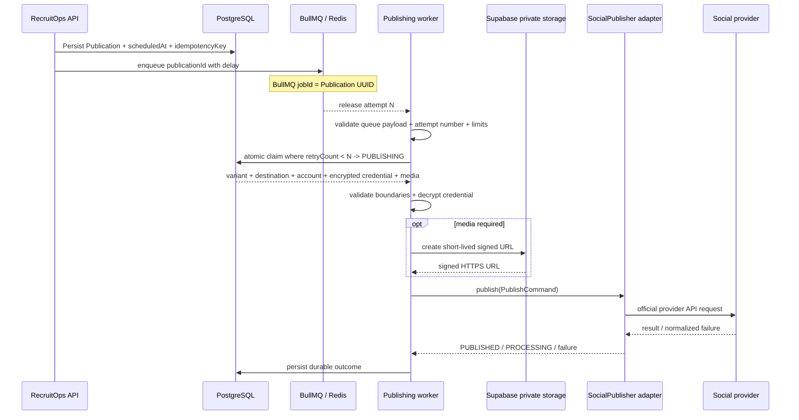

# Publication Scheduling Architecture

RecruitOps uses BullMQ for durable delayed dispatch backed by Redis.

## Boundary

The scheduler is responsible for queue timing and duplicate-safe enqueue. Provider success is established only after the publishing worker executes the stored Publication and persists the resulting state.

## Reliability

BullMQ delayed jobs are used rather than process-local timers. The queue job ID is the Publication UUID, so duplicate enqueue attempts target the same durable job identity. Retry settings use five total attempts with exponential backoff starting at one second; business retry/terminal state also remains persisted in the Publication model.

Delayed jobs are not guaranteed to execute at the exact millisecond when a worker is busy, so product UI should treat `scheduledAt` as the requested dispatch time rather than a hard real-time guarantee.

The worker binds each database claim to BullMQ's one-based attempt number. A claim succeeds only while `retryCount < attemptNumber`, then stores that attempt number while moving the Publication to `PUBLISHING`. This makes a repeated delivery of the same attempt a no-op before any provider call. It also lets attempt `N + 1` recover a `PUBLISHING` record left behind when attempt `N` crashed before persisting its final state. Initial `PENDING` / `SCHEDULED`, retryable `RETRY_WAITING`, and crash-left `PUBLISHING` states are claimable only under this monotonic-attempt condition; terminal states are not.

This recovery prevents a process crash from permanently stranding the database record, but it does not remove provider-side ambiguity. If a provider accepted attempt `N` and the process died before RecruitOps persisted the response, attempt `N + 1` may still repeat the external request when that provider has no usable idempotency mechanism.

## Failure and retry semantics

Retryable network, timeout, rate-limit, HTTP 408/425/429, and provider 5xx failures are persisted as `RETRY_WAITING` with a calculated `nextRetryAt`, then rethrown so BullMQ applies its bounded exponential retry policy. Terminal validation and provider 4xx failures are persisted as `FAILED` and acknowledged.

Only normalized failure codes are persisted. Provider response bodies and raw provider messages are not copied into `Publication.lastErrorMessage`; this prevents accidental token/PII/provider-payload persistence. Redis/BullMQ runtime error logging is likewise restricted to normalized error codes/names rather than raw error messages.

External publishing remains at-least-once in the cases where a provider does not expose a usable idempotency mechanism. An ambiguous network failure after a provider accepted a request can require operator reconciliation. RecruitOps must not claim universal exactly-once provider delivery.

## Credential boundary

OAuth credentials remain encrypted in `social_credentials`. The worker uses the same AES-256-GCM keyring implementation as the API, but decryption happens only inside the execution path after the Publication, Destination, SocialAccount, status, platform, and credential relationships are validated.

The access token is handed directly to the selected adapter in memory. It is never written to the Publication record, queue payload, browser contract, URL, or structured worker log.

## Private media boundary

Supabase Storage remains private. For Instagram and Threads media operations, the worker uses a server-only Supabase secret to create a short-lived signed HTTPS URL at execution time. The signed URL is passed to the adapter but not persisted.

Current model limitation: `PostVariant` does not store an explicit per-variant media selection. The executor therefore supplies the parent Post's ordered media set and lets each adapter enforce its supported count/type rules. A future variant-media mapping should replace this without inventing selection behavior in the worker.

## Worker limits

`@recruitops/queue` validates Publication UUID, idempotency-key consistency, scheduled timestamp, and the BullMQ attempt number before invoking the application handler.

Default limits remain intentionally conservative:

- concurrency: 4 jobs;
- rate limit: 10 jobs per 1,000 ms window.

Platform adapters may use stricter limits when provider-specific quotas are verified from current official documentation.

## Runtime activation boundary

The worker runtime is now implemented in code for the currently wired Facebook, Instagram, and Threads publisher adapters. This does **not** mean production publishing is active: a hosted worker process, production database/Redis access, server-only Supabase signing secret, OAuth encryption keyring, real provider credentials/app permissions, and real-provider integration/E2E verification are still required.

Publish Now UI remains intentionally blocked until this execution path is verified; dequeuing alone must never be presented as provider success.
