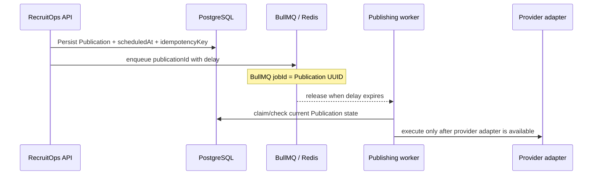

# Publication Scheduling Architecture

RecruitOps uses BullMQ for durable delayed dispatch backed by Redis.

## Boundary

The scheduler is responsible only for queue timing and duplicate-safe enqueue. It does not claim that a social post has been published.

## Reliability

BullMQ delayed jobs are used rather than process-local timers. The queue job ID is the Publication UUID, so duplicate enqueue attempts target the same durable job identity. Retry settings use five total attempts with exponential backoff starting at one second; business retry/terminal state still remains in the Publication model.

Delayed jobs are not guaranteed to execute at the exact millisecond when a worker is busy, so product UI should treat `scheduledAt` as the requested dispatch time rather than a hard real-time guarantee.

## Current completion boundary

The BullMQ scheduling primitive is complete: queue construction, delayed job options, duplicate-safe job IDs, retries/backoff, tests and graceful close are defined in `@recruitops/queue`.

Provider execution, rate-limit-aware workers and provider adapters remain separate unchecked Master Plan items. A scheduled queue job must never be interpreted as provider success.
