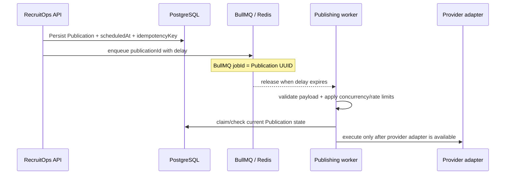

# Publication Scheduling Architecture

RecruitOps uses BullMQ for durable delayed dispatch backed by Redis.

## Boundary

The scheduler is responsible only for queue timing and duplicate-safe enqueue. It does not claim that a social post has been published.

## Reliability

BullMQ delayed jobs are used rather than process-local timers. The queue job ID is the Publication UUID, so duplicate enqueue attempts target the same durable job identity. Retry settings use five total attempts with exponential backoff starting at one second; business retry/terminal state still remains in the Publication model.

Delayed jobs are not guaranteed to execute at the exact millisecond when a worker is busy, so product UI should treat `scheduledAt` as the requested dispatch time rather than a hard real-time guarantee.

## Worker boundary

`@recruitops/queue` now exposes a publishing-worker boundary that requires an explicit provider handler. Queue payloads are validated before the handler is called, including Publication UUID, idempotency-key consistency and a parseable scheduled timestamp.

Default worker limits are intentionally conservative:

- concurrency: 4 jobs;
- rate limit: 10 jobs per 1,000 ms window.

Both values are configurable with positive-integer validation. Platform adapters may later use stricter limits when provider-specific quotas are verified from current official documentation.

The generic worker boundary does not contain a fallback provider implementation. This prevents a queue job from being consumed and marked successful when no social-platform adapter exists.

## Current completion boundary

The BullMQ scheduling and generic rate-limit-aware worker primitives are complete: delayed enqueue, duplicate-safe job IDs, retry/backoff configuration, validated worker payloads, concurrency/limiter options and tests are defined in `@recruitops/queue`.

Provider execution and provider-specific adapters remain separate unchecked Master Plan items. A scheduled or dequeued job must never be interpreted as provider success.
