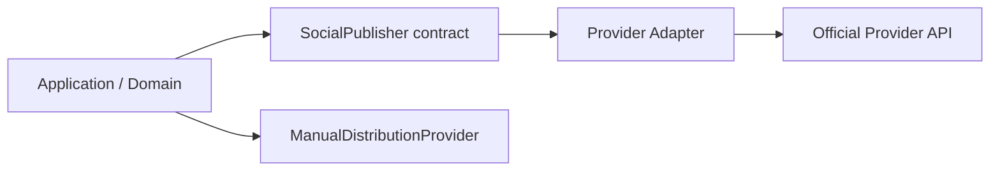

# Social Account and Destination Domain

## SocialAccount

A SocialAccount describes an authorized external identity without exposing credential material to public contracts.

Persistent state may contain a `credentialRef` that points to protected/encrypted credential storage. Shared API contracts deliberately exclude token values and credential references.

Lifecycle states:
- `CONNECTED`
- `EXPIRED`
- `REVOKED`
- `ERROR`

Provider-specific OAuth implementation remains a later task and must be verified against current official documentation before coding.

## Destination

A Destination is one place to which recruitment content may be distributed.

Types:
- Page
- Profile
- Group
- Organization
- OA
- Other

Posting modes:
- `API`: the currently implemented provider capability is allowed to publish through an official API.
- `MANUAL`: RecruitOps prepares a human-in-the-loop distribution flow.

Posting mode is capability/configuration data, not an assumption that every resource type is API-publishable.

## Tags and filtering

Destination tags are normalized to lowercase and deduplicated. The shared filter supports:
- platform;
- posting mode;
- enabled state;
- all-of tag matching;
- case-insensitive name/URL search.

This allows operators to save destinations such as location/job-category groupings without embedding filtering rules into UI components.

## Publishing boundary

No provider adapter is implemented by this domain slice. Platform-specific implementation remains gated on current official API verification.
