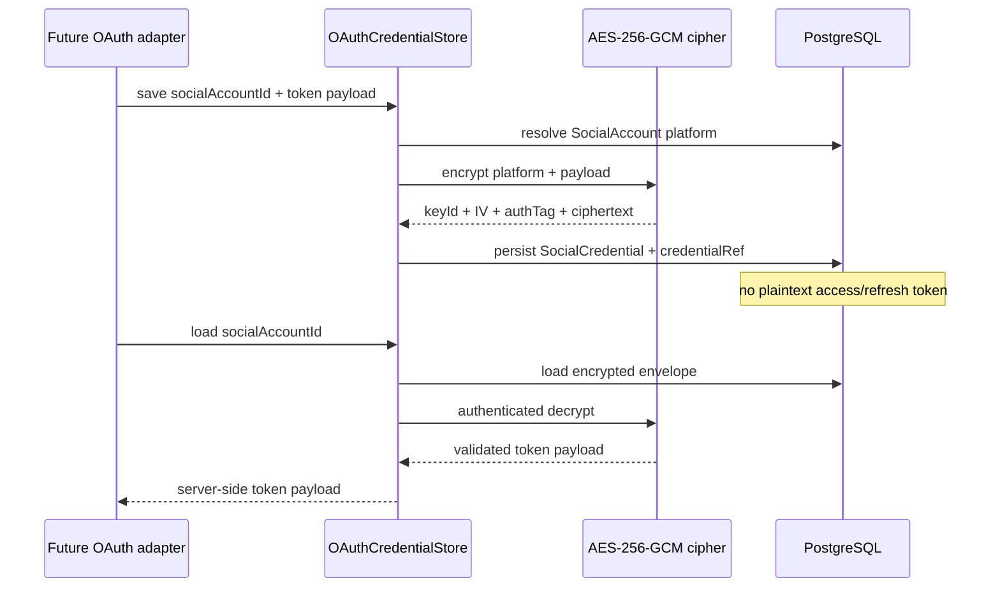
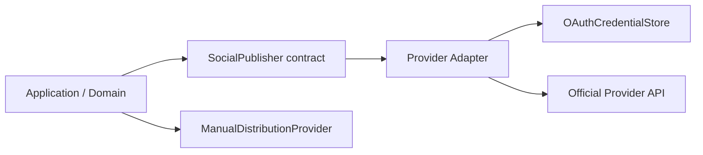

# Social Account and Destination Domain

## SocialAccount

A SocialAccount describes an authorized external identity without exposing credential material to public contracts.

`credentialRef` is an optional unique reference to `SocialCredential`. It is never a provider token. Shared API contracts deliberately exclude token values, encrypted envelopes and credential references.

Lifecycle states:
- `CONNECTED`
- `EXPIRED`
- `REVOKED`
- `ERROR`

Provider-specific OAuth connection flows remain later tasks and must be verified against current official provider documentation before coding.

## SocialCredential

`SocialCredential` is the protected persistence envelope for provider OAuth token material. It stores:

- provider platform;
- encryption key ID;
- algorithm identifier;
- IV;
- authentication tag;
- ciphertext;
- timestamps.

The API `OAuthCredentialStore` is the only application boundary introduced by this slice for saving/loading/clearing provider token payloads. It resolves the account platform, encrypts the validated payload using AES-256-GCM, persists only the encrypted envelope, and decrypts only after a server-side load.

The key ID is stored with each envelope so old keys can remain available for decryption during key rotation while new writes use the configured active key.

No HTTP controller exposes this store. The hosted migration enables RLS on `social_credentials` and revokes `anon`/`authenticated` table access.

## Destination

A Destination is one place to which recruitment content may be distributed.

Types:
- Page
- Profile
- Group
- Organization
- OA
- Other

Posting modes:
- `API`: the currently implemented provider capability is allowed to publish through an official API.
- `MANUAL`: RecruitOps prepares a human-in-the-loop distribution flow.

Posting mode is capability/configuration data, not an assumption that every resource type is API-publishable.

## Tags and filtering

Destination tags are normalized to lowercase and deduplicated. The shared filter supports:
- platform;
- posting mode;
- enabled state;
- all-of tag matching;
- case-insensitive name/URL search.

This allows operators to save destinations such as location/job-category groupings without embedding filtering rules into UI components.

## Publishing boundary

No provider adapter is implemented by the credential-storage slice. Platform-specific implementation remains gated on current official API verification.
