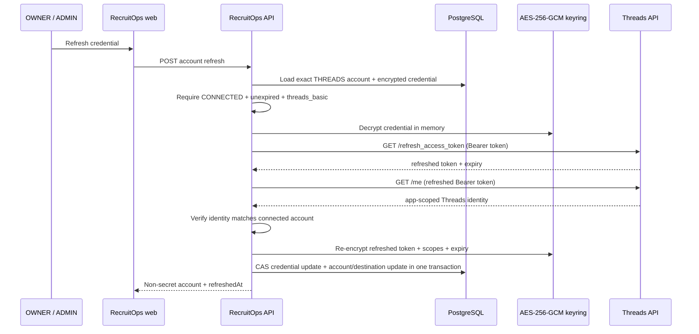

# Threads Credential Lifecycle

## Official basis

This lifecycle was rechecked against Meta's current official Threads API material on 2026-09-29.

RecruitOps uses the dedicated Threads long-lived-token refresh endpoint:

```text
GET https://graph.threads.net/refresh_access_token?grant_type=th_refresh_token
Authorization: Bearer <LONG_LIVED_THREADS_TOKEN>
```

The refresh path is valid only for an unexpired long-lived Threads user token. `threads_basic` is sufficient for the exchange/refresh lifecycle.

The current official Postman collection exposes the refresh endpoint and grant type but its rendered example does not reliably expose a response schema. RecruitOps therefore fails closed: it persists a refresh only when the live provider response contains a valid access token and a positive expiry interval. Empty or malformed successful responses are treated as provider-contract failures rather than guessed into a new expiry.

## API boundary

Only authenticated `OWNER` and `ADMIN` users may request a credential refresh:

```text
POST /api/integrations/threads/oauth/accounts/:accountId/refresh
```

The browser sends only the RecruitOps account UUID. It never receives the current or refreshed provider access token.

The API refresh flow is:



## State rules

RecruitOps intentionally does not attempt to refresh every stored credential.

- `CONNECTED` and still unexpired: refresh may proceed.
- expired by persisted account expiry or encrypted payload expiry: mark `EXPIRED` and require a new OAuth connection.
- `EXPIRED`, `REVOKED`, or `ERROR`: do not call the provider; require reconnect.
- missing credential, unreadable encrypted credential, or missing `threads_basic`: mark `ERROR` and require reconnect.
- provider error code `190` or HTTP `401` during refresh: mark `EXPIRED` and require reconnect.
- refreshed `/me` identity mismatch: mark `ERROR`, persist no new credential, and require reconnect.
- transient/network/provider failures that are not identified as invalid credentials do not overwrite the current encrypted credential.

These rules keep recovery explicit. RecruitOps never fabricates a renewed expiry for an expired token and never silently attaches a refreshed token to a different Threads identity.

## Concurrency and persistence

Credential refresh uses optimistic concurrency on `SocialCredential.updatedAt`.

A successful refresh transaction:

1. updates the exact `SocialCredential` only if its `updatedAt` still matches the value read before the provider call;
2. updates the matching Threads `SocialAccount` to `CONNECTED` with the refreshed expiry and verified display name;
3. keeps the related Threads Destination enabled in API posting mode.

If another request reconnects or refreshes the credential first, the stale refresh fails with a conflict instead of overwriting newer encrypted material.

No database migration is required for this slice.

## Health boundary

`GET /api/integrations/health` now reports a Threads provider block in addition to Meta health. The shared response keeps the Threads block additive/backward-compatible for clients deployed at slightly different times.

Threads health derives reconnect state without exposing credential material:

- missing credential -> `MISSING_CREDENTIAL`;
- expired status or expiry timestamp -> `EXPIRED`;
- revoked status -> `REVOKED`;
- error status -> `ERROR`;
- otherwise the connected account is healthy.

The Threads connection panel also reloads account state after a failed manual refresh so provider-invalid credentials immediately surface as reconnect-required UI.

## Automation boundary

This slice provides the secure refresh primitive and health state only. It does not introduce an unattended cron or background token-renewal schedule.

Automated token-health notifications remain represented by the existing Phase 8 n8n item. Any future scheduled refresh must use this server-side boundary, preserve optimistic concurrency, and avoid provider calls for already-expired credentials.

## Production boundary

This implementation still does not:

- configure a real Threads app or production credentials;
- mutate hosted secrets or infrastructure;
- enable `PUBLISHING_THREADS_ENABLED`;
- deploy an always-on worker;
- prove the live refresh response shape against a real Threads account;
- claim real-provider integration/E2E or production readiness complete.
