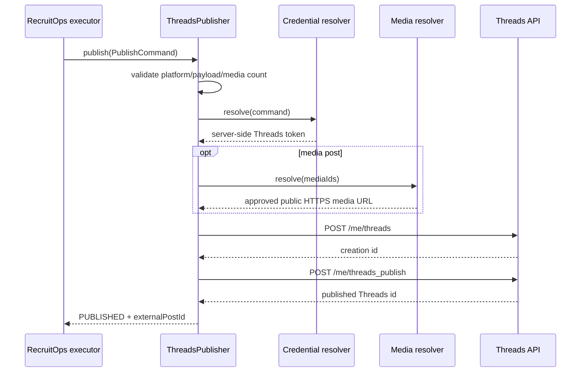

# Threads Publishing Boundary

## Verified official basis

This slice implements the documented Meta Threads API single-post flow using the official unversioned API host `https://graph.threads.net`:

1. create a media container with `POST /{threads-user-id}/threads` (RecruitOps uses `/me/threads`);
2. publish the returned container with `POST /{threads-user-id}/threads_publish` (RecruitOps uses `/me/threads_publish`).

The adapter is intentionally vendor-isolated behind the shared `SocialPublisher` contract. It does not prepend a Facebook Graph API version segment because Meta's current official Threads workspace defines the Threads `api_host` directly as `https://graph.threads.net`.

## Supported in this slice

- text-only Threads posts;
- one image post using a public HTTPS `image_url`;
- one video post using a public HTTPS `video_url`;
- canonical RecruitOps text + hashtag + link composition;
- optional media alt text from `payload.metadata.altText`;
- provider errors normalized without copying provider response bodies into application errors.

This slice does **not** claim support for carousel posts, polls, GIF attachments, quote/repost operations, topic/location tagging, ghost posts, reply approval controls, or other advanced Threads features. The Master Plan item remains incomplete until the intended currently-supported capability set is explicitly selected and verified.

## Credential boundary

The adapter receives a resolved server-side Threads access token through `ThreadsPublishingContextResolver`. The token is sent only in the HTTP `Authorization: Bearer ...` header and is never placed in a URL, payload contract, log message, or browser-facing response.

The future execution resolver must obtain the token from the durable `SocialAccount -> SocialCredential` boundary and decrypt only at the execution point.

## Media boundary

The adapter accepts RecruitOps media IDs, not arbitrary user-entered remote URLs. `ThreadsPublishingMediaResolver` converts approved media IDs into temporary/public provider-readable HTTPS URLs.

Resolved media URLs must:

- use HTTPS;
- contain no embedded username/password credentials;
- match the requested media IDs exactly.

The current single-post slice rejects more than one media ID.

## Flow

## Runtime activation still required

The adapter alone does not make Threads production-active. Production requires a dedicated Threads connection/OAuth flow, current required scopes and app review/access, durable Threads credentials, executor wiring, and real-provider integration/E2E verification.
