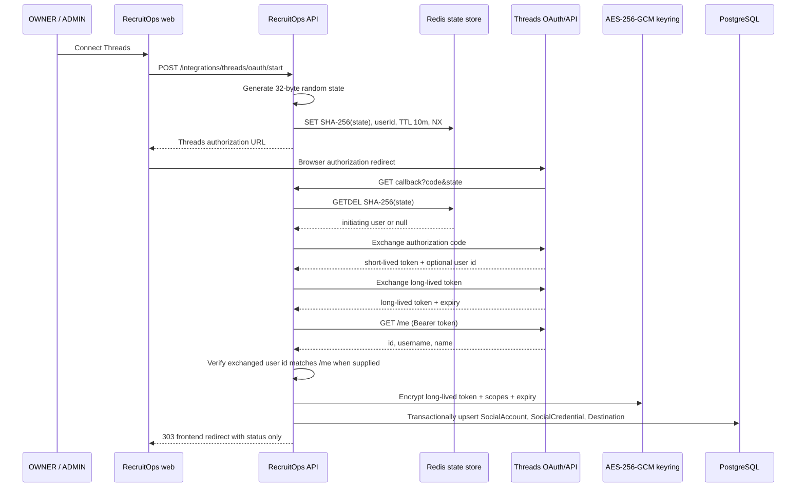
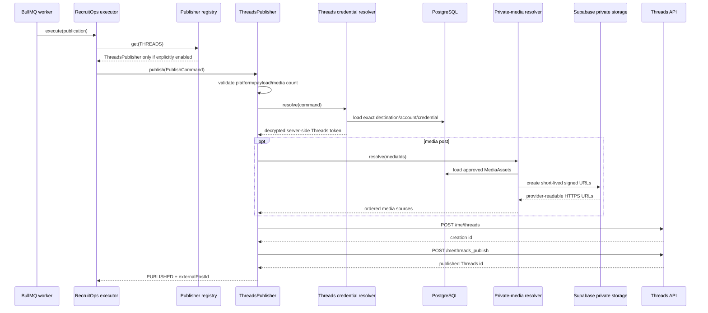

# Threads Publishing Boundary

## Verified official basis

RecruitOps follows the current Meta Threads API flow on `https://graph.threads.net`:

1. configure a Meta app with the Threads use case;
2. authorize the Threads user through the Authorization Code flow on `https://threads.net/oauth/authorize`;
3. request only the publishing permissions needed by the current slice: `threads_basic` and `threads_content_publish`;
4. exchange the authorization code at `POST https://graph.threads.net/oauth/access_token`;
5. exchange the short-lived credential for a long-lived Threads credential at `GET https://graph.threads.net/access_token` using `grant_type=th_exchange_token`;
6. verify the app-scoped Threads identity through `GET https://graph.threads.net/me`;
7. create a media container with `POST /me/threads`;
8. publish the returned container with `POST /me/threads_publish`.

Meta's official Threads Postman workspace was rechecked before the connection/runtime implementation. RecruitOps intentionally does not use the Facebook Graph host or prepend a Facebook Graph API version to Threads endpoints.

## Dedicated OAuth connection flow

Threads authorization is modeled separately from the Facebook/Instagram Meta connection flow because the Threads OAuth grant resolves directly to one app-scoped Threads user. There is no second Page/account picker.

The implemented flow is:

Security properties:

- raw OAuth state is never stored in Redis; only its SHA-256 digest is used as the key;
- state is one-time through Redis `GETDEL` and expires after ten minutes;
- only authenticated `OWNER`/`ADMIN` users can start authorization or list Threads connections;
- the public callback receives the provider code/state but returns no token to the browser;
- the short-lived access token is not placed in the long-lived-token URL;
- profile calls use `Authorization: Bearer ...`;
- provider response bodies are not copied into application errors;
- the long-lived credential is encrypted before durable database persistence;
- reconnect updates the existing `(THREADS, externalAccountId)` account and credential rather than creating duplicates;
- `Destination` is promoted as an enabled `PROFILE` destination in `API` posting mode.

## Supported publishing slice

- text-only Threads posts;
- one image post using a provider-readable HTTPS `image_url`;
- one video post using a provider-readable HTTPS `video_url`;
- canonical RecruitOps text + hashtag + link composition;
- optional media alt text from `payload.metadata.altText`;
- provider errors normalized without copying provider response bodies into application errors;
- worker credential resolution from the exact durable Threads destination/account/credential relation;
- opt-in worker registry wiring behind `PUBLISHING_THREADS_ENABLED`.

This slice does **not** claim support for carousel posts, polls, GIF attachments, quote/repost operations, topic/location tagging, ghost posts, reply approval controls, or other advanced Threads features. The Master Plan item remains incomplete until the intended currently-supported capability set and real-provider verification are complete.

## Credential boundary

`PrismaThreadsPublishingContextResolver` loads the exact `Destination -> SocialAccount -> SocialCredential` relation at execution time. Before decrypting anything it verifies:

- the publish command targets `THREADS`;
- the selected Destination and SocialAccount both target `THREADS`;
- the Destination belongs to the command's SocialAccount;
- the SocialAccount is still `CONNECTED`;
- persisted account scopes include `threads_basic` and `threads_content_publish`.

The encrypted credential is then decrypted in memory through the shared AES-256-GCM OAuth keyring. The decrypted payload must still declare both required scopes. Only the access token is returned to `ThreadsPublisher`.

The token is sent only in the HTTP `Authorization: Bearer ...` header and is never placed in queue payloads, browser-facing contracts, application logs, or Publication persistence.

## Media boundary

The adapter accepts RecruitOps media IDs, not arbitrary user-entered remote URLs. `PrismaProviderMediaResolver` converts the explicit ordered media IDs into short-lived Supabase signed HTTPS URLs only inside the trusted worker boundary.

Resolved media URLs must:

- use HTTPS;
- contain no embedded username/password credentials;
- map exactly to the requested media IDs;
- originate from the configured private Supabase project signing boundary.

The current single-post slice rejects more than one media ID.

## Runtime activation

Threads remains fail-closed by default. `PUBLISHING_THREADS_ENABLED` is absent/false unless an operator deliberately enables the worker capability.

When the flag is enabled:

- valid server-only Supabase signing configuration is mandatory;
- missing/invalid signing configuration fails worker bootstrap;
- the production publisher registry receives the shared provider-media resolver and registers `ThreadsPublisher`;
- startup telemetry includes `THREADS` only when that activation path succeeds.

The same provider-media resolver can serve Instagram and Threads when both are enabled. Private storage keys and signed URL bearer tokens remain outside generic publication persistence.

## Publishing flow

## Remaining activation work

The code path does not make Threads production-ready. Remaining gates are:

- configure real `THREADS_CLIENT_ID`, `THREADS_CLIENT_SECRET`, callback and frontend return URIs for an approved Threads app/use case;
- verify code exchange, long-lived-token behavior and `/me` identity against a real Threads account;
- enable the hosted publishing flag only through the approved production secret-management process;
- deploy an always-on worker when infrastructure supports it;
- run real-provider integration/E2E verification before claiming production readiness;
- explicitly decide which advanced Threads capabilities belong in the product scope before completing the Master Plan adapter item.
