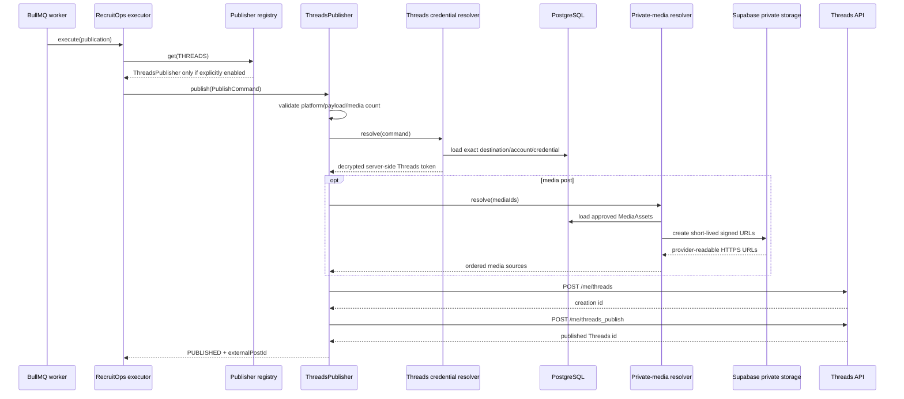

# Threads Publishing Boundary

## Verified official basis

This slice follows the current Meta Threads API single-post flow on `https://graph.threads.net`:

1. authorize a Threads user with the Threads OAuth flow;
2. require `threads_basic` and `threads_content_publish` for this publishing capability;
3. create a media container with `POST /{threads-user-id}/threads` (RecruitOps uses `/me/threads`);
4. publish the returned container with `POST /{threads-user-id}/threads_publish` (RecruitOps uses `/me/threads_publish`).

Meta's official Threads Postman workspace was rechecked before this runtime wiring. The adapter intentionally does not use the Facebook Graph host or prepend the Meta Facebook Graph API version because the current Threads API host is `https://graph.threads.net`.

## Supported in this slice

- text-only Threads posts;
- one image post using a provider-readable HTTPS `image_url`;
- one video post using a provider-readable HTTPS `video_url`;
- canonical RecruitOps text + hashtag + link composition;
- optional media alt text from `payload.metadata.altText`;
- provider errors normalized without copying provider response bodies into application errors;
- worker credential resolution from the exact durable Threads destination/account/credential relation;
- opt-in worker registry wiring behind `PUBLISHING_THREADS_ENABLED`.

This slice does **not** claim support for carousel posts, polls, GIF attachments, quote/repost operations, topic/location tagging, ghost posts, reply approval controls, or other advanced Threads features. The Master Plan item remains incomplete until the intended currently-supported capability set and the dedicated connection flow are verified end to end.

## Credential boundary

`PrismaThreadsPublishingContextResolver` loads the exact `Destination -> SocialAccount -> SocialCredential` relation at execution time. Before decrypting anything it verifies:

- the publish command targets `THREADS`;
- the selected Destination and SocialAccount both target `THREADS`;
- the Destination belongs to the command's SocialAccount;
- the SocialAccount is still `CONNECTED`;
- persisted account scopes include `threads_basic` and `threads_content_publish`.

The encrypted credential is then decrypted in memory through the shared AES-256-GCM OAuth keyring. The decrypted payload must still declare both required scopes. Only the access token is returned to `ThreadsPublisher`.

The token is sent only in the HTTP `Authorization: Bearer ...` header and is never placed in queue payloads, browser-facing contracts, URLs, application logs, or Publication persistence.

## Media boundary

The adapter accepts RecruitOps media IDs, not arbitrary user-entered remote URLs. `PrismaProviderMediaResolver` converts the explicit ordered media IDs into short-lived Supabase signed HTTPS URLs only inside the trusted worker boundary.

Resolved media URLs must:

- use HTTPS;
- contain no embedded username/password credentials;
- map exactly to the requested media IDs;
- originate from the configured private Supabase project signing boundary.

The current single-post slice rejects more than one media ID.

## Runtime activation

Threads remains fail-closed by default. `PUBLISHING_THREADS_ENABLED` is absent/false unless an operator deliberately enables the worker capability.

When the flag is enabled:

- valid server-only Supabase signing configuration is mandatory;
- missing/invalid signing configuration fails worker bootstrap;
- the production publisher registry receives the shared provider-media resolver and registers `ThreadsPublisher`;
- startup telemetry includes `THREADS` only when that activation path succeeds.

The same provider-media resolver can serve Instagram and Threads when both are enabled. Private storage keys and signed URL bearer tokens remain outside generic publication persistence.

## Flow

## Remaining activation work

The worker runtime alone does not make Threads production-ready. Remaining gates are:

- implement the dedicated Threads OAuth connection flow and durable account promotion;
- configure a real Meta app with the Threads use case, redirect URI and required reviewed access;
- verify token exchange/refresh and account identity against a real Threads account;
- inject hosted worker secrets/flags only through the approved production secret-management process;
- deploy an always-on worker when infrastructure supports it;
- run real-provider integration/E2E verification before claiming production readiness;
- explicitly decide which advanced Threads capabilities belong in the product scope before completing the Master Plan adapter item.
