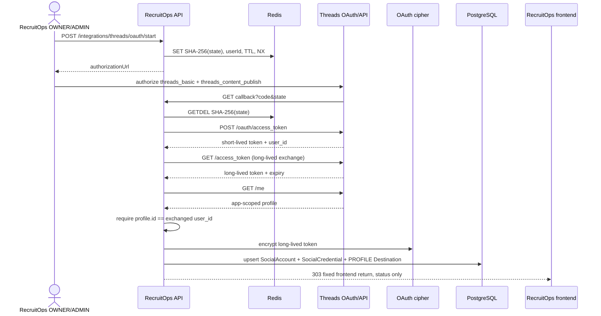
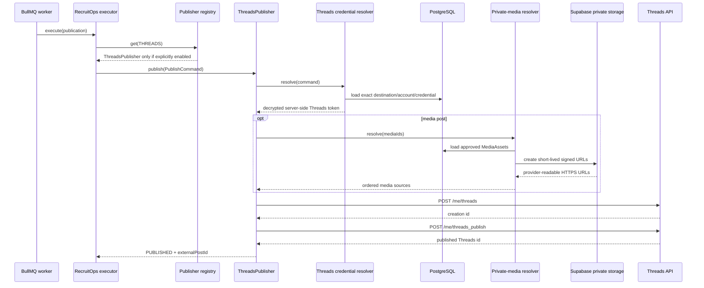

# Threads Publishing Boundary

## Verified official basis

RecruitOps follows Meta's current Threads-specific OAuth and publishing contracts on `https://threads.net` and `https://graph.threads.net`:

1. redirect an authenticated RecruitOps OWNER/ADMIN to `https://threads.net/oauth/authorize`;
2. request only `threads_basic` and `threads_content_publish` for the current publishing slice;
3. exchange the callback authorization code at `POST https://graph.threads.net/oauth/access_token`;
4. exchange the short-lived user token for a long-lived token through `GET /access_token` with `grant_type=th_exchange_token`;
5. resolve the app-scoped Threads profile from `GET /me` and verify it matches the user ID returned by the code exchange;
6. create a media container with `POST /me/threads`;
7. publish the returned container with `POST /me/threads_publish`.

The Threads OAuth path is intentionally independent of the Facebook/Instagram Meta connection flow. RecruitOps does not reuse a Facebook Page token for Threads.

## Connection and credential boundary

`POST /api/integrations/threads/oauth/start` is restricted to OWNER/ADMIN users. The API generates 32 bytes of cryptographically random state and stores only `SHA-256(state)` in Redis for ten minutes. State is consumed atomically with `GETDEL`, so expired or replayed callbacks fail before any provider token exchange.

The public callback never receives or returns a RecruitOps bearer token. After state consumption it:

1. exchanges the one-time provider code server-side;
2. obtains a long-lived Threads token;
3. loads the app-scoped Threads profile with the long-lived token;
4. requires the profile ID to equal the user ID returned by the code exchange;
5. encrypts the long-lived credential with the shared AES-256-GCM OAuth keyring;
6. transactionally creates or reconnects the `THREADS` `SocialAccount`, encrypted `SocialCredential`, and API `PROFILE` Destination.

The durable SocialAccount stores only non-secret account metadata, scopes, status, and token expiry. Provider token material never enters browser URLs, queue payloads, application logs, or Publication persistence.

`THREADS_APP_ID`, `THREADS_APP_SECRET`, `THREADS_REDIRECT_URI`, and `THREADS_FRONTEND_REDIRECT_URI` are server-side runtime configuration. Production HTTPS is required for the frontend return URL; plain HTTP is allowed only for localhost development.

## Supported publishing slice

- text-only Threads posts;
- one image post using a provider-readable HTTPS `image_url`;
- one video post using a provider-readable HTTPS `video_url`;
- canonical RecruitOps text + hashtag + link composition;
- optional media alt text from `payload.metadata.altText`;
- provider errors normalized without copying provider response bodies into application errors;
- worker credential resolution from the exact durable Threads destination/account/credential relation;
- opt-in worker registry wiring behind `PUBLISHING_THREADS_ENABLED`.

This slice does **not** claim support for carousel posts, polls, GIF attachments, quote/repost operations, topic/location tagging, ghost posts, reply approval controls, or other advanced Threads features. The Master Plan item remains incomplete until the intended currently-supported capability set and real-provider verification are completed.

## Worker credential boundary

`PrismaThreadsPublishingContextResolver` loads the exact `Destination -> SocialAccount -> SocialCredential` relation at execution time. Before decrypting anything it verifies:

- the publish command targets `THREADS`;
- the selected Destination and SocialAccount both target `THREADS`;
- the Destination belongs to the command's SocialAccount;
- the SocialAccount is still `CONNECTED`;
- persisted account scopes include `threads_basic` and `threads_content_publish`.

The encrypted credential is then decrypted in memory through the shared AES-256-GCM OAuth keyring. The decrypted payload must still declare both required scopes. Only the access token is returned to `ThreadsPublisher`.

## Media boundary

The adapter accepts RecruitOps media IDs, not arbitrary user-entered remote URLs. `PrismaProviderMediaResolver` converts the explicit ordered media IDs into short-lived Supabase signed HTTPS URLs only inside the trusted worker boundary.

Resolved media URLs must:

- use HTTPS;
- contain no embedded username/password credentials;
- map exactly to the requested media IDs;
- originate from the configured private Supabase project signing boundary.

The current single-post slice rejects more than one media ID.

## Runtime activation

Threads remains fail-closed by default. `PUBLISHING_THREADS_ENABLED` is absent/false unless an operator deliberately enables the worker capability.

When the flag is enabled:

- valid server-only Supabase signing configuration is mandatory;
- missing/invalid signing configuration fails worker bootstrap;
- the production publisher registry receives the shared provider-media resolver and registers `ThreadsPublisher`;
- startup telemetry includes `THREADS` only when that activation path succeeds.

The same provider-media resolver can serve Instagram and Threads when both are enabled. Private storage keys and signed URL bearer tokens remain outside generic publication persistence.

## Connection flow

## Publishing flow

## Remaining production work

The code-side connection and worker runtime do not make Threads production-ready. Remaining gates are:

- configure a real Meta app with the Threads use case, exact redirect URI and required reviewed access;
- configure the server-only Threads app credentials and fixed frontend return URL in the hosted API;
- verify authorization, long-lived token exchange/refresh, reconnect behavior and account identity against a real Threads account;
- enable hosted worker secrets/flags only through the approved production secret-management process;
- deploy an always-on worker when infrastructure supports it;
- run real-provider integration/E2E verification before claiming production readiness;
- explicitly decide which advanced Threads capabilities belong in the product scope before completing the Master Plan adapter item.
