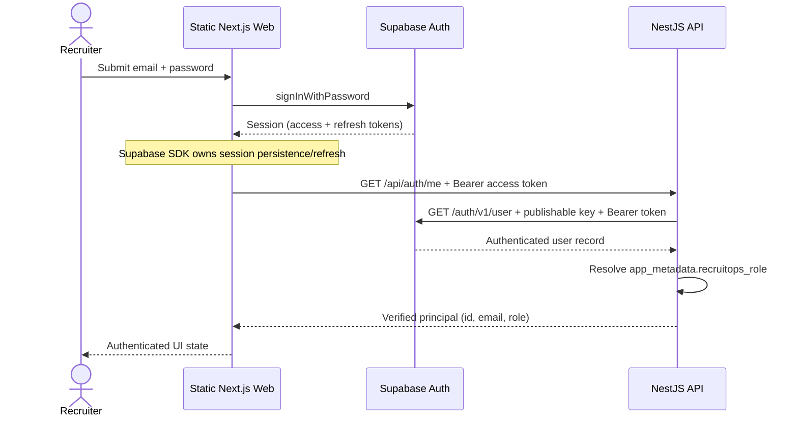

# Authentication Session Sequence

The API treats the browser token as untrusted until Supabase Auth validates it. RecruitOps does not log or persist bearer tokens outside the Supabase client-managed browser session.
