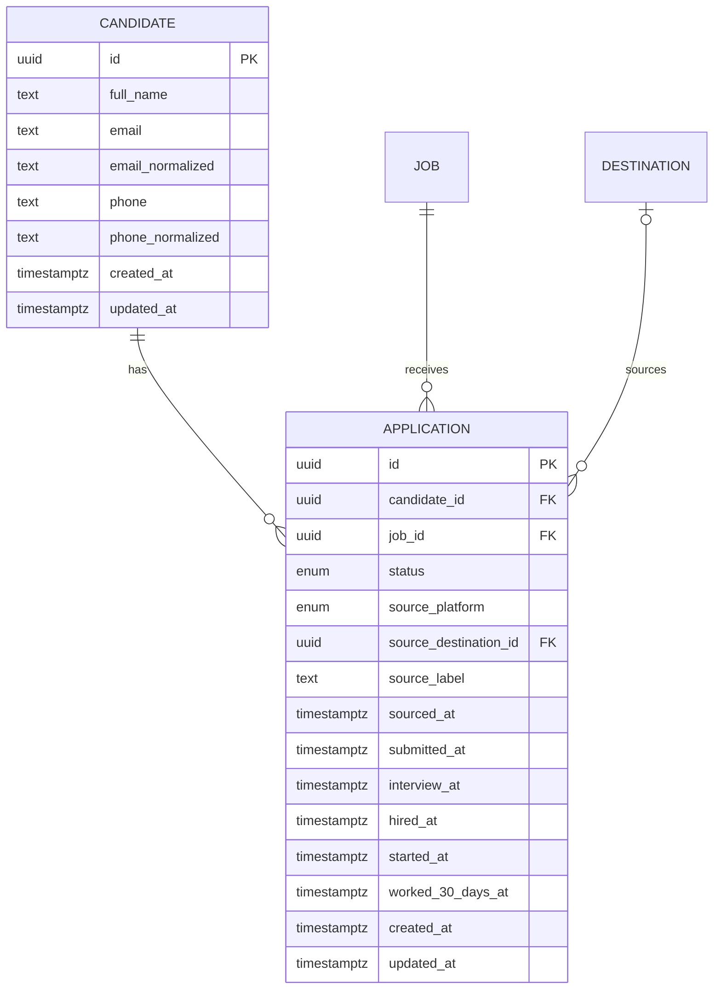

# Candidate and Application ERD

```mermaid
erDiagram
    CANDIDATE ||--o{ APPLICATION : has
    JOB ||--o{ APPLICATION : receives
    DESTINATION o|--o{ APPLICATION : sources

    CANDIDATE {
      uuid id PK
      text full_name
      text email
      text email_normalized
      text phone
      text phone_normalized
      timestamptz created_at
      timestamptz updated_at
    }

    APPLICATION {
      uuid id PK
      uuid candidate_id FK
      uuid job_id FK
      enum status
      enum source_platform
      uuid source_destination_id FK
      text source_label
      timestamptz sourced_at
      timestamptz submitted_at
      timestamptz interview_at
      timestamptz hired_at
      timestamptz started_at
      timestamptz worked_30_days_at
      timestamptz created_at
      timestamptz updated_at
    }
```
