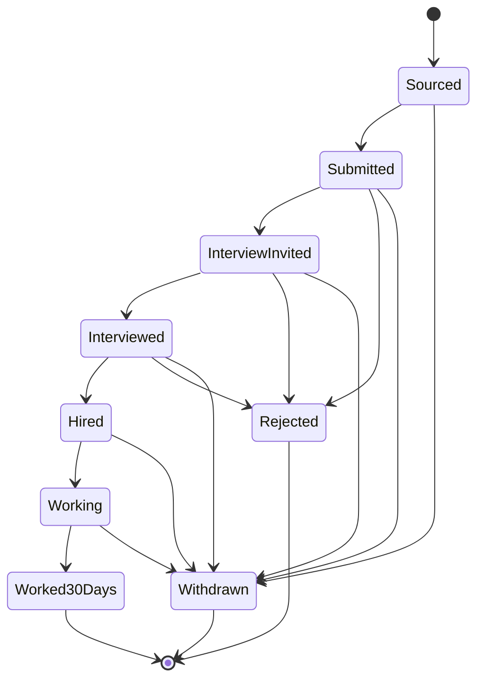

# Candidate / Application Lifecycle

```mermaid
stateDiagram-v2
    [*] --> Sourced
    Sourced --> Submitted
    Sourced --> Withdrawn
    Submitted --> InterviewInvited
    Submitted --> Rejected
    Submitted --> Withdrawn
    InterviewInvited --> Interviewed
    InterviewInvited --> Rejected
    InterviewInvited --> Withdrawn
    Interviewed --> Hired
    Interviewed --> Rejected
    Interviewed --> Withdrawn
    Hired --> Working
    Hired --> Withdrawn
    Working --> Worked30Days
    Working --> Withdrawn
    Rejected --> [*]
    Worked30Days --> [*]
    Withdrawn --> [*]
```

The shared `@recruitops/contracts` transition helper is the executable lifecycle source. Update this diagram with the helper in the same change.
