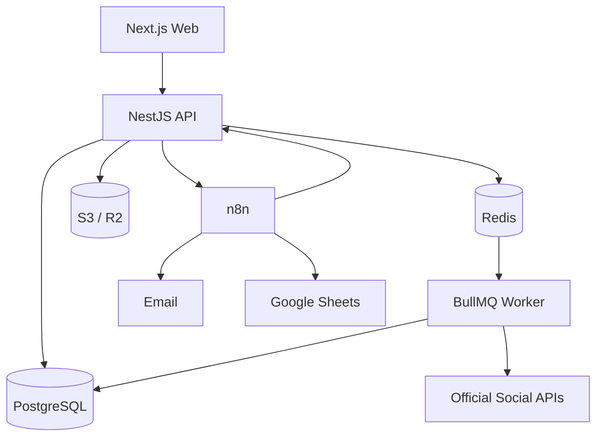

# Container Architecture

```mermaid
flowchart TB
    WEB[Next.js Web]
    API[NestJS API]
    WORKER[BullMQ Worker]
    DB[(PostgreSQL)]
    REDIS[(Redis)]
    STORE[(S3 / R2)]
    N8N[n8n]
    SOCIAL[Official Social APIs]
    MAIL[Email]
    SHEETS[Google Sheets]

    WEB --> API
    API --> DB
    API --> REDIS
    API --> STORE
    API --> N8N
    REDIS --> WORKER
    WORKER --> DB
    WORKER --> SOCIAL
    N8N --> MAIL
    N8N --> SHEETS
    N8N --> API
```
