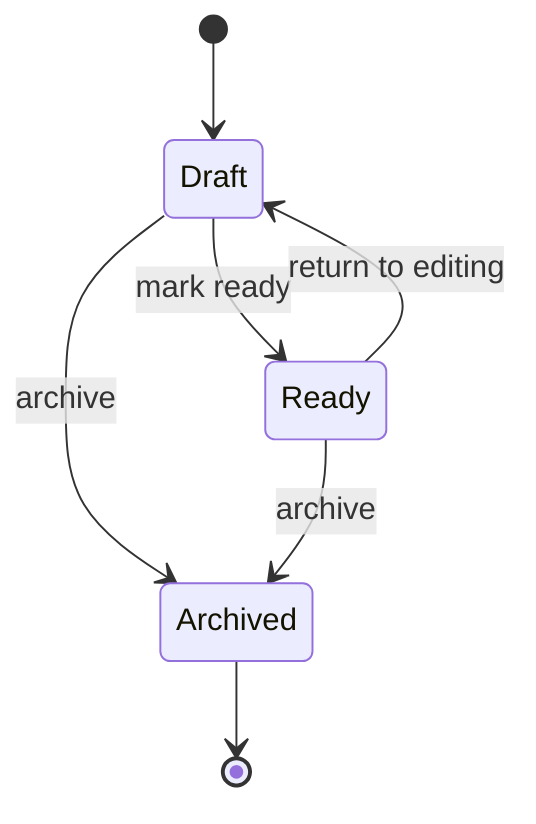

# Content Draft State

`Archived` is terminal in the shared domain transition helper. Restoring archived content, if ever required, must be an explicit product decision rather than an accidental state mutation.
