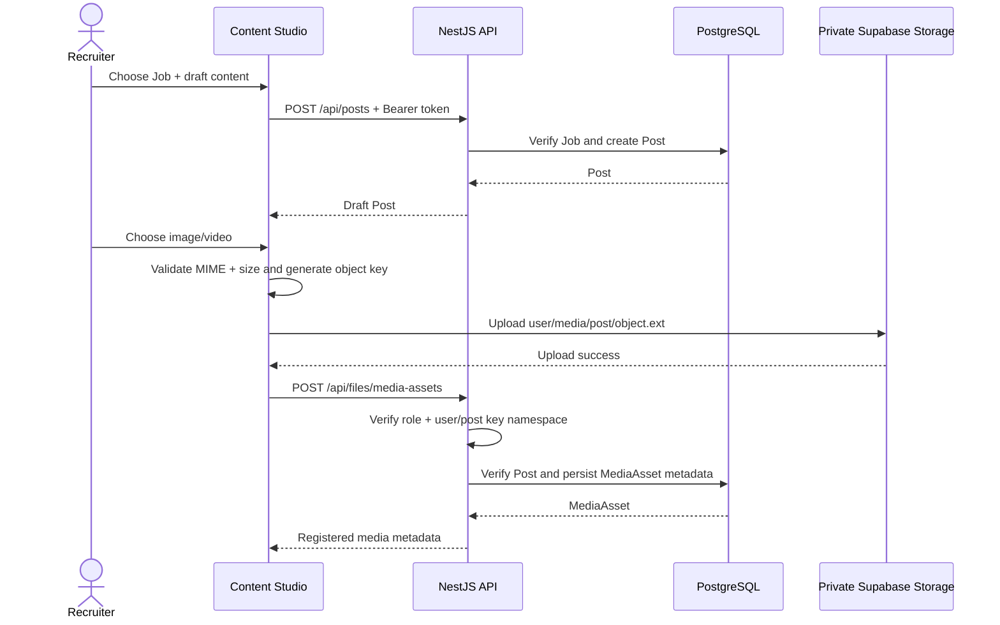

# Content and Media Flow

A storage upload that fails is never registered as a `MediaAsset`. A metadata registration failure does not make the object public; cleanup/reconciliation of orphaned private objects can be added as an operational maintenance flow later.
