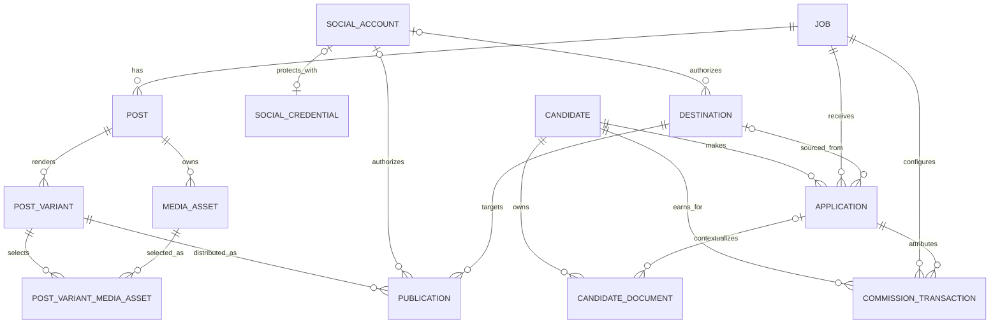

# Implemented Database ERD

This diagram contains implemented persisted models only. `CommissionTransaction` is now part of the implemented schema; reconciliation batches remain excluded until their schema exists.

`PostVariantMediaAsset` is an explicit ordered join. Its `position` controls provider payload ordering and its foreign keys prevent selections from referring to missing variants/assets. The API additionally verifies that every selected asset belongs to the same canonical Post as the PostVariant.

`Application.sourceUserId` records the authenticated RecruitOps principal that sourced an application. It is intentionally stored as an immutable UUID attribution value instead of trusting a browser-supplied user ID. `Application.interviewInvitedAt` preserves the stakeholder's first commission milestone separately from the later attended-interview timestamp.

`CommissionTransaction` is an append-oriented financial ledger row linked to the candidate, job and source application. Money is stored in integer minor units. `idempotencyKey` prevents the same business event from being appended twice. `beneficiaryUserId` preserves the authenticated CTV/principal attribution even though authentication users are owned by Supabase Auth rather than a local application-user table. Full duplicate-CV allocation and reconciliation-batch relations are added in their dedicated Phase 7 slices.

`MediaAsset.storageKey` and `CandidateDocument.storageKey` are private object-storage references, not public URLs. `SocialAccount.credentialRef` references an encrypted `SocialCredential` envelope and is never itself a provider token.
