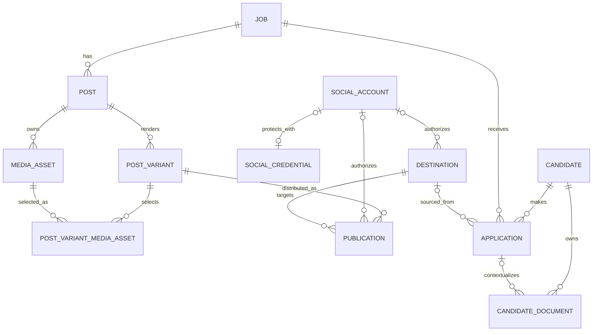

# Implemented Database ERD

This diagram contains implemented persisted models only. Planned Commission/Reconciliation entities are intentionally excluded until their schema exists.

`PostVariantMediaAsset` is an explicit ordered join. Its `position` controls provider payload ordering and its foreign keys prevent selections from referring to missing variants/assets. The API additionally verifies that every selected asset belongs to the same canonical Post as the PostVariant.

`MediaAsset.storageKey` and `CandidateDocument.storageKey` are private object-storage references, not public URLs. `SocialAccount.credentialRef` references an encrypted `SocialCredential` envelope and is never itself a provider token.
