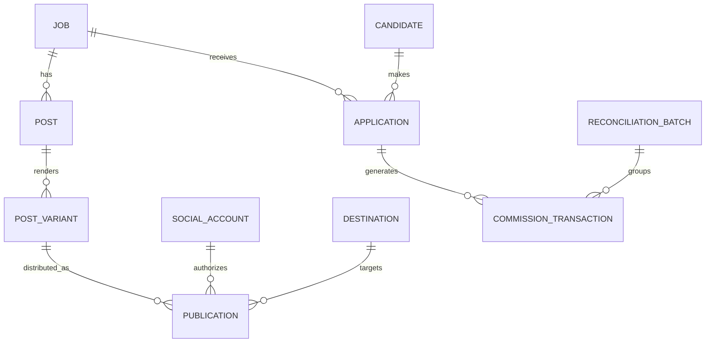

# Initial Database ERD

```mermaid
erDiagram
    JOB ||--o{ POST : has
    POST ||--o{ POST_VARIANT : renders
    POST_VARIANT ||--o{ PUBLICATION : distributed_as
    SOCIAL_ACCOUNT ||--o{ PUBLICATION : authorizes
    DESTINATION ||--o{ PUBLICATION : targets
    CANDIDATE ||--o{ APPLICATION : makes
    JOB ||--o{ APPLICATION : receives
    APPLICATION ||--o{ COMMISSION_TRANSACTION : generates
    RECONCILIATION_BATCH ||--o{ COMMISSION_TRANSACTION : groups
```
