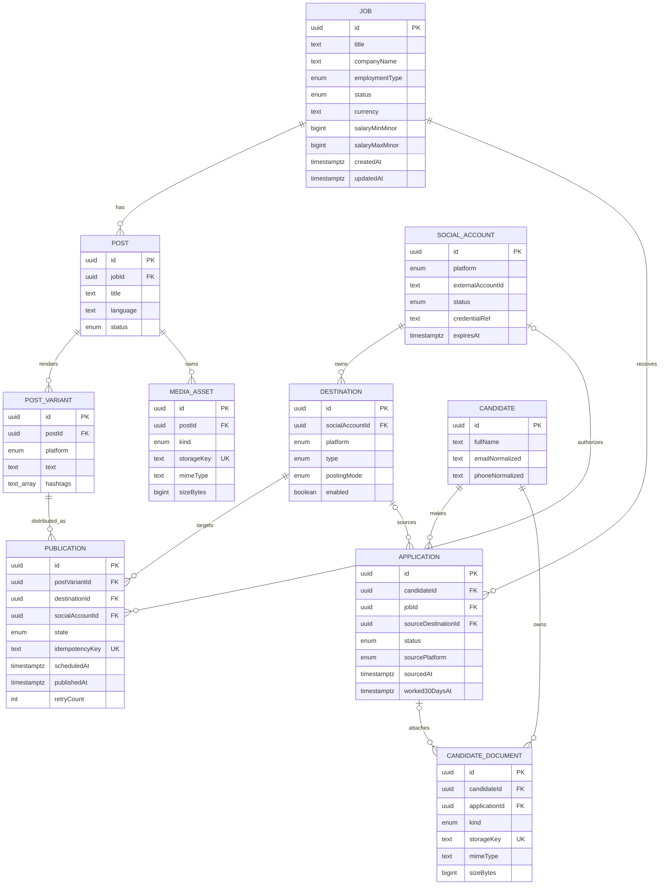

# Current Database ERD

This diagram reflects the models that currently exist in `packages/database/prisma/schema.prisma`. Planned commission and reconciliation models are intentionally excluded until they are implemented.

The Prisma schema is the persistence source of truth. When the schema changes, this diagram must be updated in the same implementation slice.
