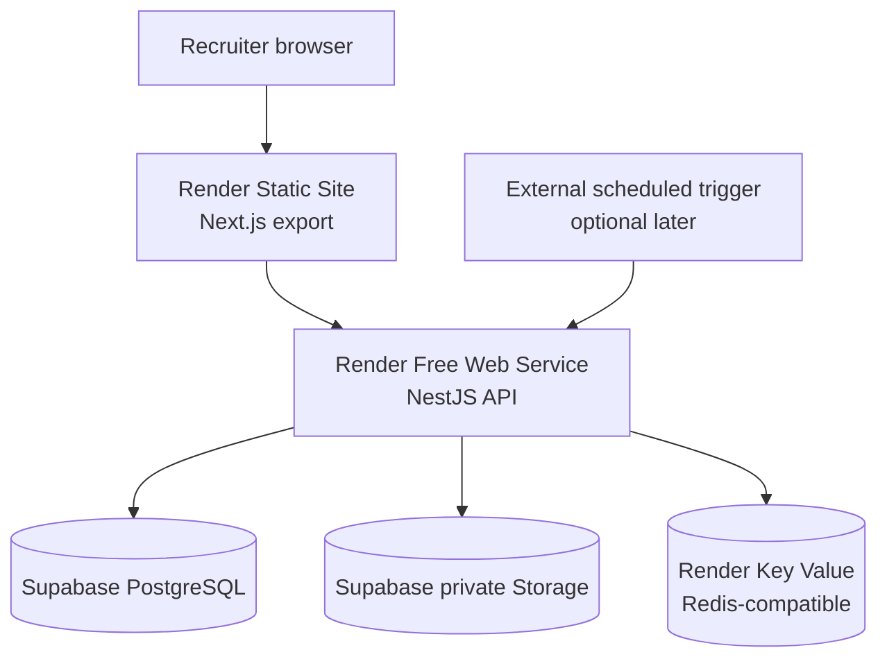

# Free-tier Deployment Topology

```mermaid
flowchart TB
    USER[Recruiter browser]
    WEB[Render Static Site\nNext.js export]
    API[Render Free Web Service\nNestJS API]
    DB[(Supabase PostgreSQL)]
    STORE[(Supabase private Storage)]
    REDIS[(Render Key Value\nRedis-compatible)]
    QSTASH[External scheduled trigger\noptional later]

    USER --> WEB
    WEB --> API
    API --> DB
    API --> STORE
    API --> REDIS
    QSTASH --> API
```

The separately deployable `apps/worker` remains part of the target architecture but is intentionally not shown as an always-on free service.
