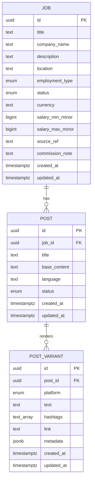

# Job and Content ERD

```mermaid
erDiagram
    JOB ||--o{ POST : has
    POST ||--o{ POST_VARIANT : renders

    JOB {
      uuid id PK
      text title
      text company_name
      text description
      text location
      enum employment_type
      enum status
      text currency
      bigint salary_min_minor
      bigint salary_max_minor
      text source_ref
      text commission_note
      timestamptz created_at
      timestamptz updated_at
    }

    POST {
      uuid id PK
      uuid job_id FK
      text title
      text base_content
      text language
      enum status
      timestamptz created_at
      timestamptz updated_at
    }

    POST_VARIANT {
      uuid id PK
      uuid post_id FK
      enum platform
      text text
      text_array hashtags
      text link
      jsonb metadata
      timestamptz created_at
      timestamptz updated_at
    }
```
