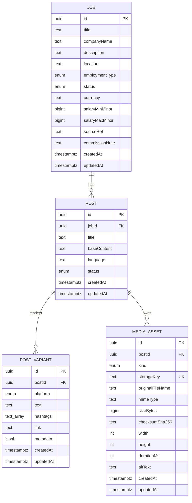

# Job and Content ERD

This Phase 3 view focuses on Job Hub, content drafts, platform variants, and private media metadata.

`MediaAsset` stores metadata and a private object-storage key, not public file bytes or a permanent public URL. The upload/persistence UI flow remains a separate incomplete Master Plan item.
