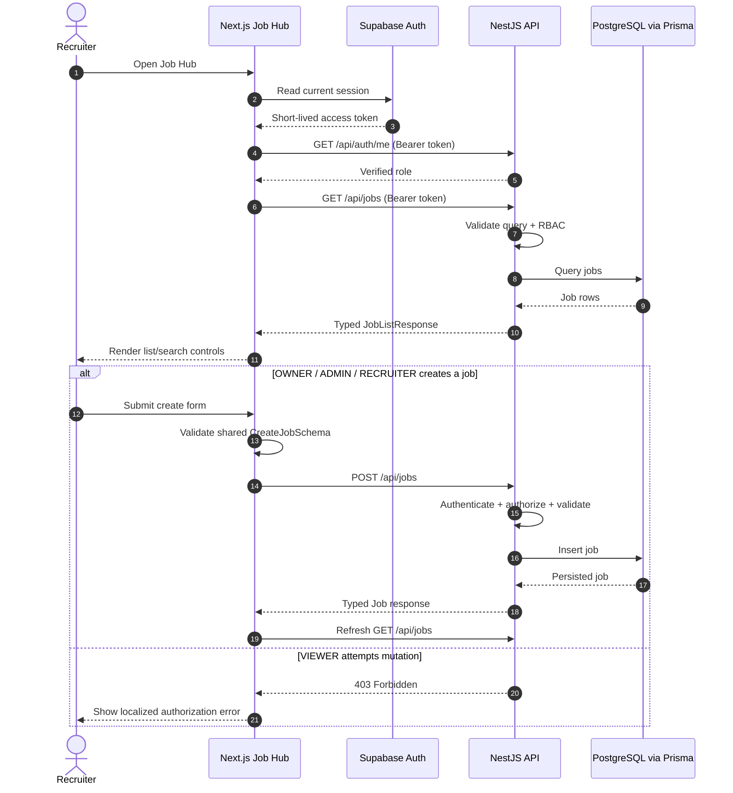

# Job Hub Request Sequence

The browser never uses the Supabase Data API to mutate RecruitOps domain tables. Supabase supplies identity; NestJS remains the domain authorization and persistence boundary.
