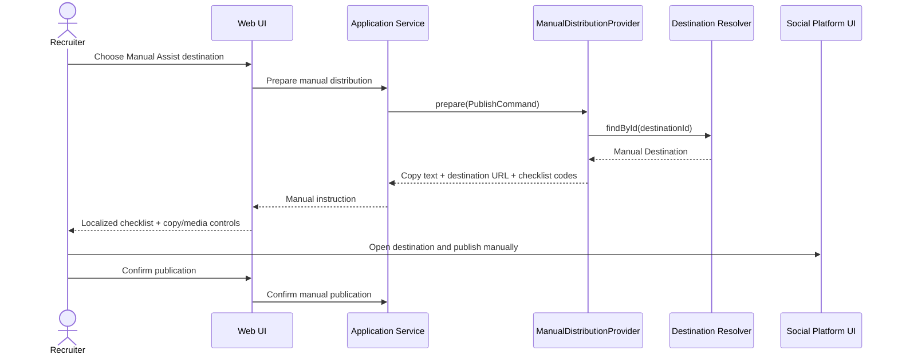

# Manual Assist Distribution Flow

```mermaid
sequenceDiagram
    actor R as Recruiter
    participant W as Web UI
    participant A as Application Service
    participant M as ManualDistributionProvider
    participant D as Destination Resolver
    participant P as Social Platform UI

    R->>W: Choose Manual Assist destination
    W->>A: Prepare manual distribution
    A->>M: prepare(PublishCommand)
    M->>D: findById(destinationId)
    D-->>M: Manual Destination
    M-->>A: Copy text + destination URL + checklist codes
    A-->>W: Manual instruction
    W-->>R: Localized checklist + copy/media controls
    R->>P: Open destination and publish manually
    R->>W: Confirm publication
    W->>A: Confirm manual publication
```

The final confirmation endpoint/application service is not implemented by this slice and therefore remains outside the completed checklist scope.
