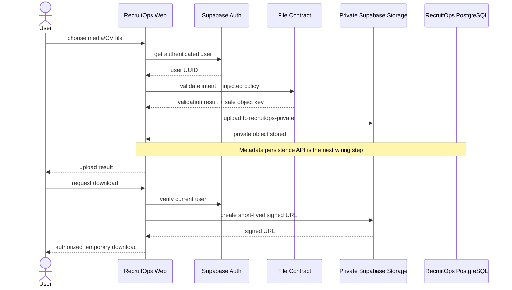

# Private File Flow

```mermaid
sequenceDiagram
    actor User
    participant Web as RecruitOps Web
    participant Auth as Supabase Auth
    participant Contract as File Contract
    participant Storage as Private Supabase Storage
    participant DB as RecruitOps PostgreSQL

    User->>Web: choose media/CV file
    Web->>Auth: get authenticated user
    Auth-->>Web: user UUID
    Web->>Contract: validate intent + injected policy
    Contract-->>Web: validation result + safe object key
    Web->>Storage: upload to recruitops-private
    Storage-->>Web: private object stored
    Note over Web,DB: Metadata persistence API is the next wiring step
    Web-->>User: upload result

    User->>Web: request download
    Web->>Auth: verify current user
    Web->>Storage: create short-lived signed URL
    Storage-->>Web: signed URL
    Web-->>User: authorized temporary download
```

The canonical object key never embeds the original filename. The first path segment is the authenticated RecruitOps user UUID to match Supabase Storage RLS.
