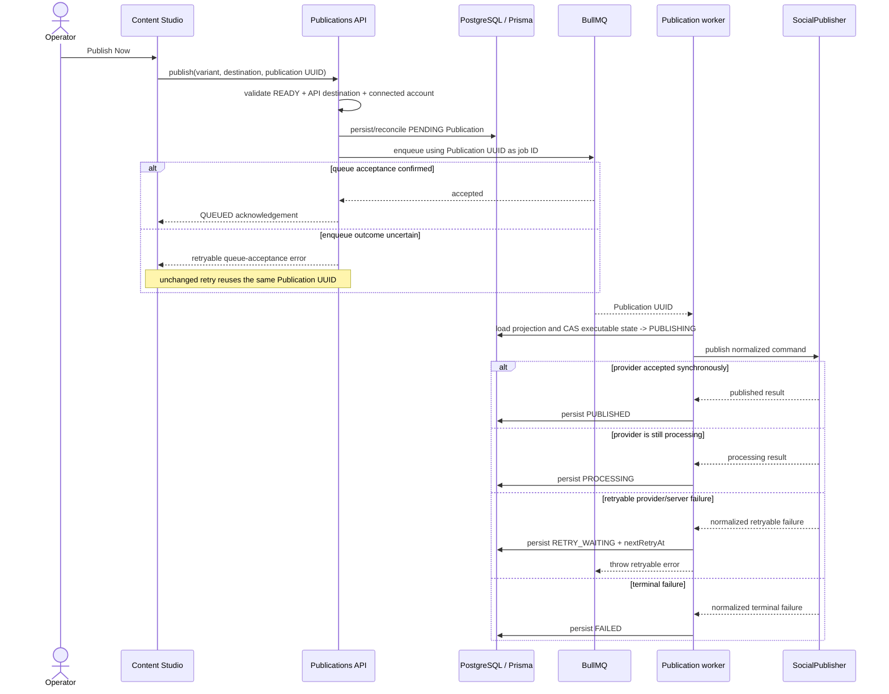
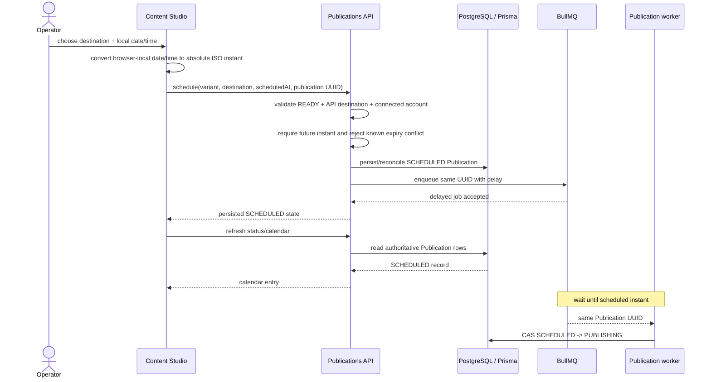
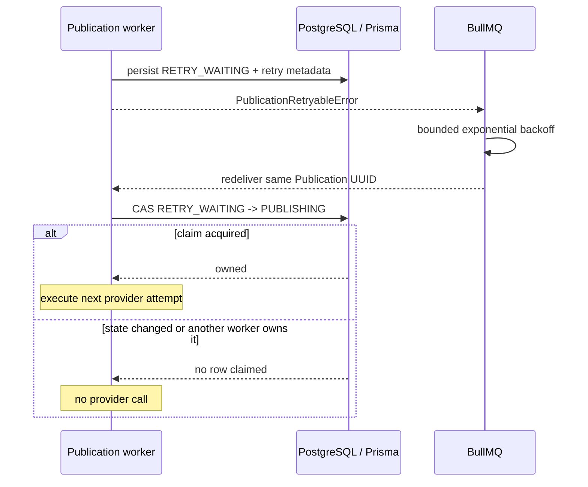

# Publication Operations Sequences

These diagrams describe the current RecruitOps control-plane and worker behavior for immediate publishing, scheduled publishing, automatic retry, and guarded manual recovery. The durable `Publication` row and its UUID remain authoritative across API, BullMQ, worker, and provider boundaries.

## Publish now



`QUEUED` means BullMQ accepted dispatch; it is not provider success.

## Scheduled publication



If `scheduledAt` passes while the durable row remains `SCHEDULED`, operators treat it as a queue/worker health signal rather than provider failure.

## Automatic retry



Automatic retry is bounded to the configured Publication retry budget; the generic executor retries only normalized HTTP 429 and provider/server failures with status 500 or greater.

## Manual retry and ambiguous outcome gate

```mermaid
sequenceDiagram
    actor Operator
    participant UI as Content Studio
    participant API as Publications API
    participant DB as PostgreSQL / Prisma
    participant Queue as BullMQ
    participant Worker as Publication worker

    Operator->>UI: Retry failed publication
    UI->>API: retry(publicationId, expected updatedAt)
    API->>DB: load current Publication
    alt state is not FAILED
        API-->>UI: 409 fail closed
    else ambiguous outcome or idempotency mismatch
        API-->>UI: manual review required; no replay
    else retry eligible
        API->>DB: optimistic retry-budget reset
        API->>Queue: inspect job by Publication UUID
        alt retained job is failed
            API->>Queue: retry retained job and reset attempts
        else retained job is missing
            API->>Queue: enqueue same Publication UUID
        else job already queued or active
            Queue-->>API: existing queue state
        else incompatible queue state
            API-->>UI: fail closed
        end
        API->>DB: reload authoritative Publication state
        API-->>UI: retry acceptance/status
        Queue-->>Worker: same Publication UUID when runnable
    end
```

A Publication already persisted as `PUBLISHING` after an interrupted provider call is an ambiguous external outcome. RecruitOps does not automatically or manually replay it until an operator verifies the provider side.