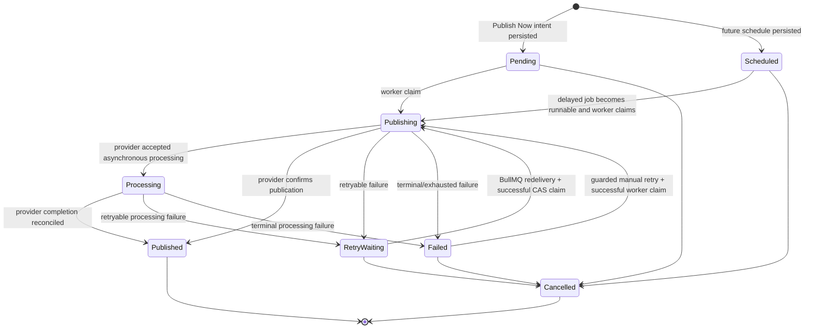

# Publication State

The shared contract in `@recruitops/contracts` is the executable source for allowed state transitions. This diagram documents that contract and the currently implemented control paths; it must change in the same PR if transition rules change.

Operational interpretation:

- `SCHEDULED` past `scheduledAt` is a queue/worker health signal, not proof of provider failure.
- `RETRY_WAITING` is owned by automatic BullMQ retry/backoff and must not be manually replayed.
- `FAILED` may enter a guarded manual-retry flow only when the API declares the failure retryable.
- `PUBLISHING` after an interrupted provider call can represent an ambiguous external outcome. RecruitOps fails closed rather than blindly replaying it.
- `PUBLISHED` and `CANCELLED` are terminal.

See `docs/diagrams/publication-operations-sequence.md` and `docs/operations/runbooks/publication-operations.md` for the queue/API/worker recovery flows.