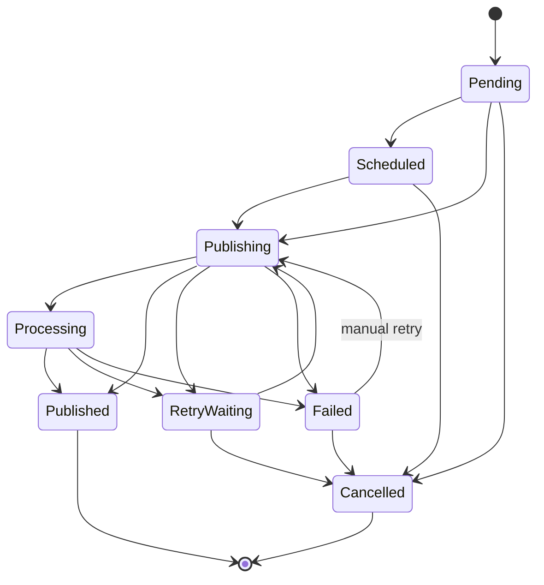

# Publication State

The shared contract in `@recruitops/contracts` is the executable source for allowed state transitions. This diagram documents that contract and must change in the same PR if transition rules change.
