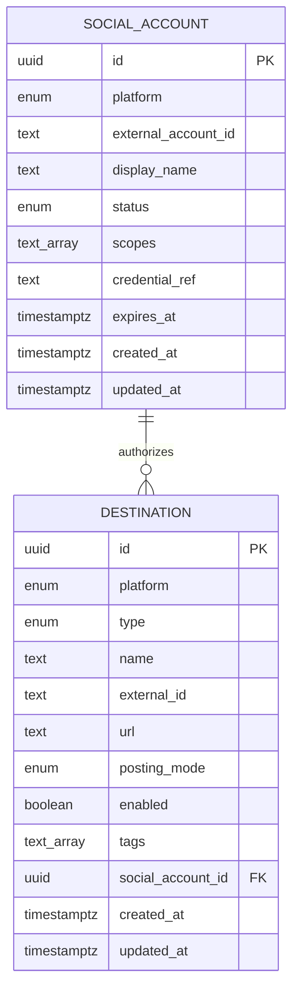

# Social Domain ERD

```mermaid
erDiagram
    SOCIAL_ACCOUNT ||--o{ DESTINATION : authorizes

    SOCIAL_ACCOUNT {
      uuid id PK
      enum platform
      text external_account_id
      text display_name
      enum status
      text_array scopes
      text credential_ref
      timestamptz expires_at
      timestamptz created_at
      timestamptz updated_at
    }

    DESTINATION {
      uuid id PK
      enum platform
      enum type
      text name
      text external_id
      text url
      enum posting_mode
      boolean enabled
      text_array tags
      uuid social_account_id FK
      timestamptz created_at
      timestamptz updated_at
    }
```

`credential_ref` is never an OAuth token. It is a pointer/key for protected credential material when secure credential storage is implemented for social providers.
