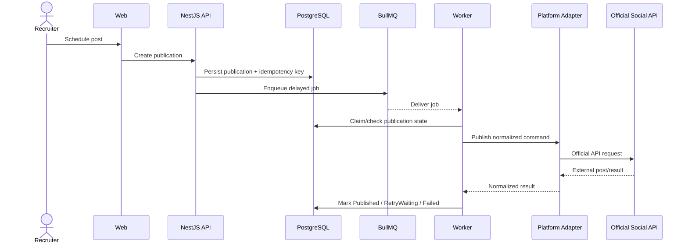

# Social Publishing Sequence

```mermaid
sequenceDiagram
    actor U as Recruiter
    participant W as Web
    participant A as NestJS API
    participant D as PostgreSQL
    participant Q as BullMQ
    participant K as Worker
    participant P as Platform Adapter
    participant S as Official Social API

    U->>W: Schedule post
    W->>A: Create publication
    A->>D: Persist publication + idempotency key
    A->>Q: Enqueue delayed job
    Q-->>K: Deliver job
    K->>D: Claim/check publication state
    K->>P: Publish normalized command
    P->>S: Official API request
    S-->>P: External post/result
    P-->>K: Normalized result
    K->>D: Mark Published / RetryWaiting / Failed
```
