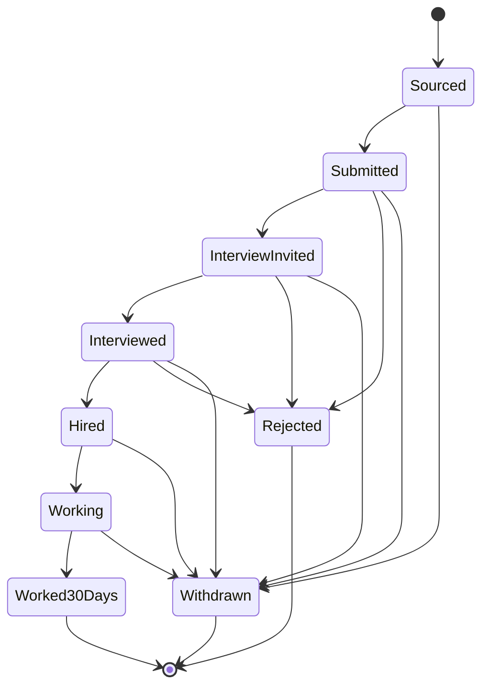

# Candidate and Application Domain

## Scope

This slice models candidate identity, one candidate's recruitment process for a job, source attribution, duplicate signals, and lifecycle state. It does not yet implement CV storage, Candidate APIs, UI, or commission calculations.

## Candidate

A Candidate represents a person, not a submission event.

Stored contact fields are PII:
- full name;
- optional email;
- optional phone.

At least one of email or phone is required at the shared validation boundary. Persistence also stores normalized email/phone values for duplicate lookup. Those normalized fields are still PII and receive the same access controls as their display values.

## Duplicate detection strategy

RecruitOps produces deterministic candidate duplicate-signal keys from normalized contact data:

```text
email:<lowercase-trimmed-email>
phone:<digits-or-leading-plus-and-digits>
```

These keys are matching signals, not automatic merge authority. A possible match should be reviewed by application logic/operator rules before records are merged or a submission is classified as a duplicate. This avoids silently collapsing different people who share contact information.

The database indexes normalized email and phone for candidate lookup but deliberately does not add a uniqueness constraint at this stage.

## Application

An Application represents one Candidate's recruitment process for one Job. Multiple Application records are technically allowed because a candidate may return or be resubmitted later; duplicate policy is handled explicitly instead of being hidden inside a `(candidateId, jobId)` uniqueness constraint.

Source attribution belongs to the Application because one Candidate may be sourced from different channels at different times.

Source fields:
- optional social platform;
- optional saved Destination;
- optional source label for non-structured/manual sources.

## Recruitment lifecycle



`REJECTED`, `WORKED_30_DAYS`, and `WITHDRAWN` are terminal in the current shared transition helper. Any future reopen/reapply behavior should create or explicitly reopen an Application through an approved product rule rather than mutating terminal history silently.

## Milestone timestamps

Application persistence has explicit timestamps for source, submission, interview, hire, work start, and 30-day milestone. These timestamps support later reporting and commission events without putting commission calculations into the Candidate domain.
