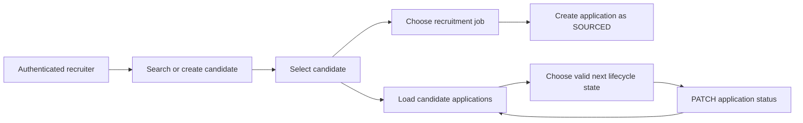

# Candidate CRM UI

The Candidate CRM is an authenticated browser workspace backed by the RecruitOps NestJS Candidate/Application API. It does not read or mutate recruitment records through the Supabase Data API.

## Authentication and authorization

The browser obtains the current Supabase Auth session, forwards the access token to the RecruitOps API, and resolves the effective application role through `GET /auth/me`.

- `OWNER`, `ADMIN`, and `RECRUITER` can create candidates, create applications, and move applications through valid lifecycle transitions.
- `VIEWER` can read candidates and applications but cannot mutate them.
- UI controls are disabled/omitted according to the role, while the API remains the authoritative authorization boundary.

## Supported workflow

The UI imports the shared `canTransitionApplicationStatus` state-machine rule and only offers the current state plus transitions allowed by that contract. The API independently enforces the same rule, so browser manipulation cannot bypass lifecycle validation.

## Validation and data handling

Candidate creation uses the shared Zod contract. A candidate must have a name and at least one valid contact method. Candidate email and phone are PII; the UI displays them only inside the authenticated CRM workspace and does not add them to analytics or debug logging.

Application creation uses Job records loaded through the authenticated Job API. Candidate/Application requests are parsed with shared response schemas before state is updated in the browser.

## Internationalization and accessibility

All user-facing Candidate CRM strings live in the `candidates` namespace of the VI/EN message catalogs. Native buttons, labels, selects, form semantics, live loading regions, and screen-reader-only labels are used so the workflow remains keyboard accessible.

## Deferred scope

CV upload/download UI is intentionally handled as the next isolated slice. Candidate editing/merging and commission operations are also outside this UI slice.
